### Pixel

Pixel ...Mit Pixel werden die einzelnen Farbwerte einer digitalen Rastergrafik bezeichnet
            
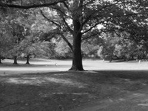 

- Dieses Foto besteht aus 248 (Spalten) x 186 (Zeilen)= 46128 Pixels
- Normalerweise ein Byte (0-255) wird zugewiesen, um ein schwarz weiß Pixel zu speichern. 
- ganz Schwarz = 0 / ganz Weiß = 255
- Die Datenmenge des Bildes = 46128 byte = 46kb

### Matrix

Matrix ist ein Puffer wie buffer~/table/multislider aber sehr flexibel.

- buffer~ = 1D Puffer / float
- table = 1D Puffer / int
- multislider = 1D Puffer / float
- matrix = nD Puffer (n kann zwischen 2 und 33) / byte oder float oder int

#### Schwerzweiß Pixel

- jit.matrix
- jit.pwindow

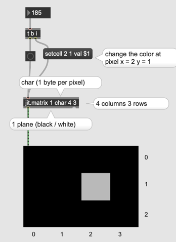

### Farbe in Computergrafik

[RGB Color Model ](https://www.w3schools.com/colors/colors_picker.asp)

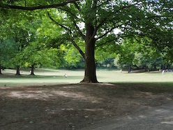 

- Dieses Foto besteht aus 248 (Spalten) x 186 (Zeilen)= 46128 Pixels
- Die Datenmenge des Bildes = 46128 byte 
- RGB Plane f￿ür die Farbe 46128 * 3 = 138384 byte = 138 kb

Die Puffer f￿ür bunte Bilder muss drei dimensional  
Spalten (248) x Zeilen (186) x Farben (3)

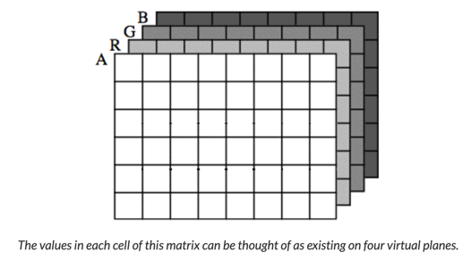

a ... alpha = Transparenz

#### RGB Pixel

#### Arithmetik

- jit.+
- jit.*

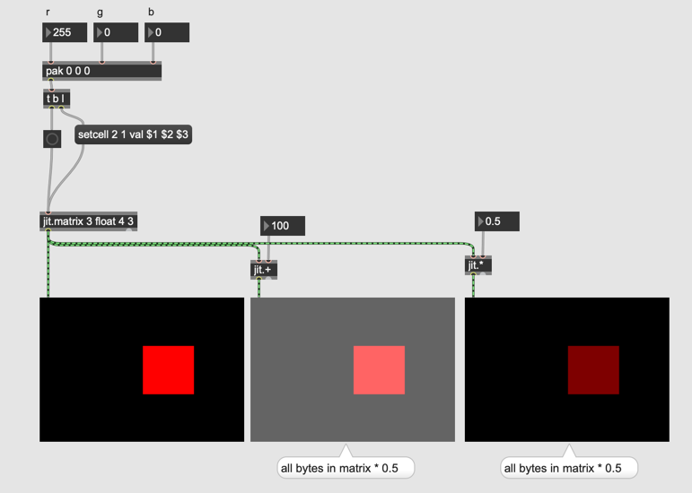

#### Import

- jit.matrixinfo

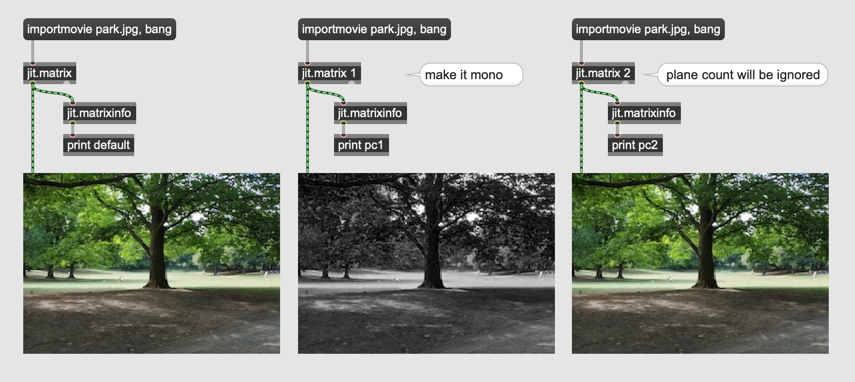

#### Arithmetische Operation f￿ür indivisuelle Planes

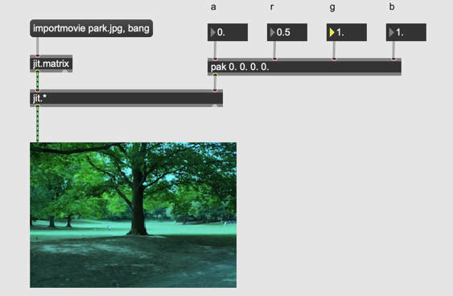

#### Swatch

- swatch

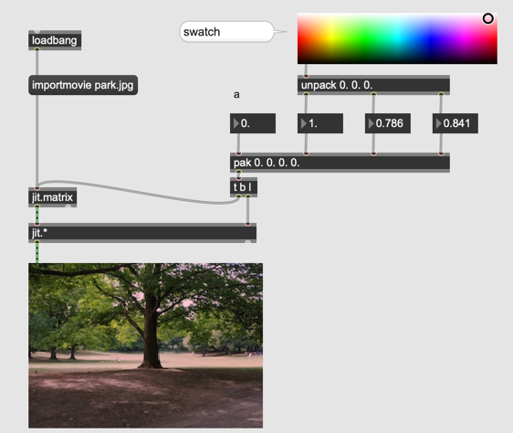

#### Skalierung und Addition

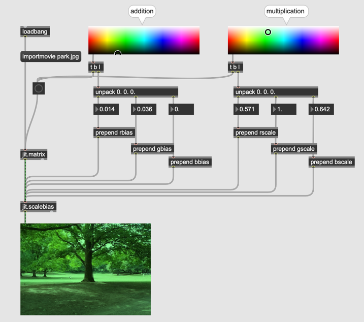

#### Austausch

- jit.unpack
- jit.pack

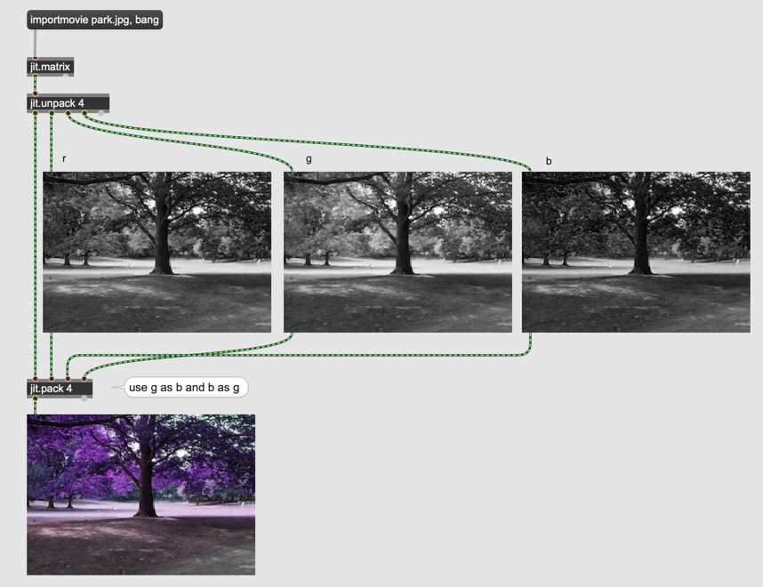

#### Videodatei

- jit.qt.movie

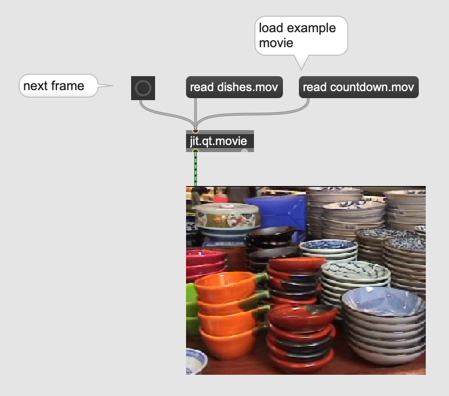

#### Metro f￿ür Video

- qmetro

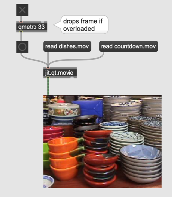

#### Fenster f￿ür Video

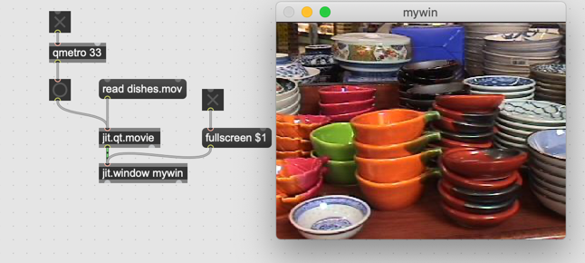

#### ￿Änderung der Aufl￿ösung 

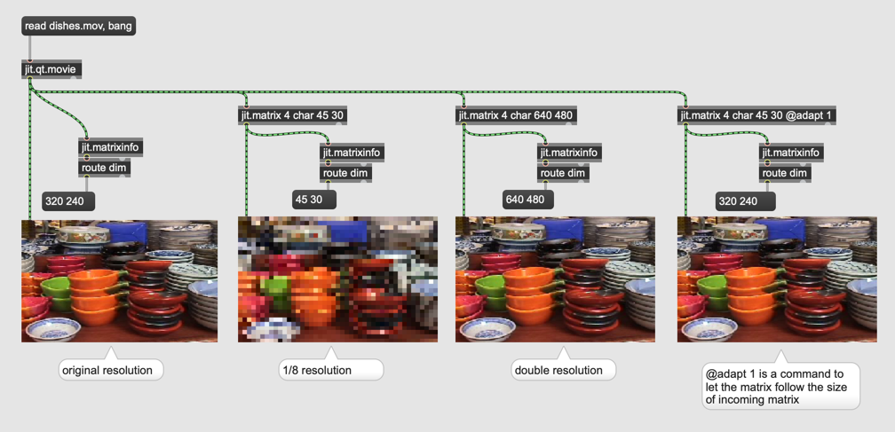

#### Unterschiedliche Aufl￿ösungen und Arithmetische Operation

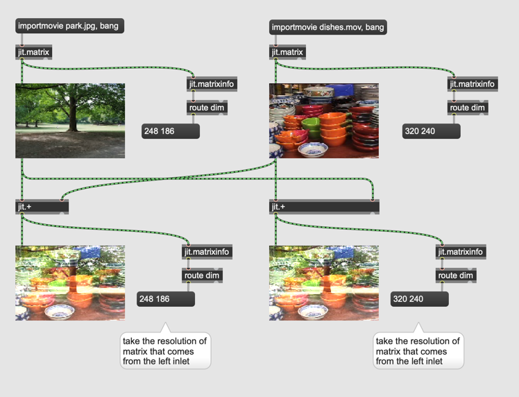

#### Ein Teil von der Quelle

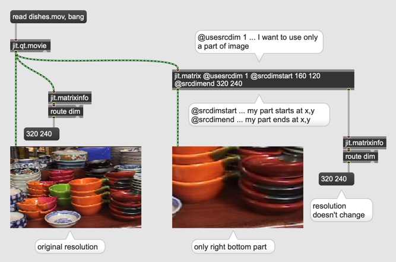

#### Ein Teil von der Matrix

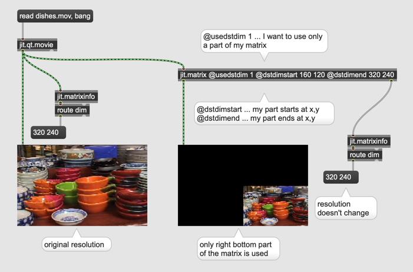

#### Aufgabe

Programmieren Sie ein Patch das folgende Bild erzeugt. 
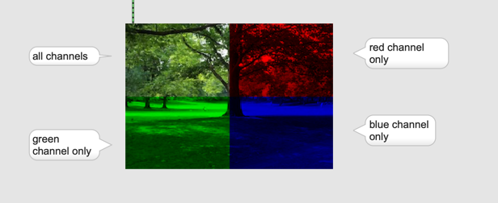

#### Ein- /Ausblenden

- jit.xfade

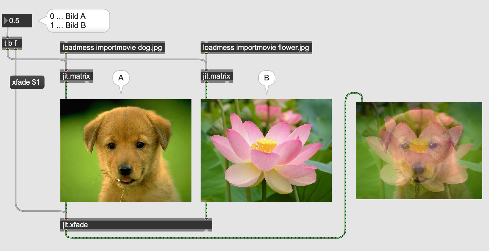

#### Photoshop Effekte

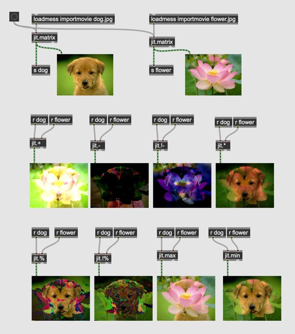

