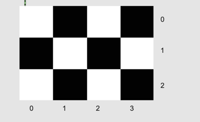
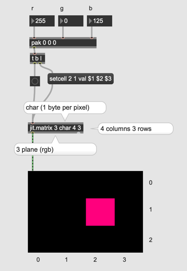

# Pixel and Matrix

### Pixel

Pixel ... A pixel is the smallest unit of a digital image, representing a single point of color and brightness. These pixels are arranged in a grid pattern across screens or image sensors, combining to form the complete picture we see on displays like monitors. The resolution of an image or display is determined by the number of pixels it contains horizontally and vertically.

 

- This photo consists of 248 (Columns) x 186 (Rows) = 46128 Pixels
- Normally a byte (0-255) is used to save a monochrome pixel. 
- completely black = 0 / completely white = 255
- The total data size of the image = 46128 byte = 46kb

#### Assignment 1

What is the data size in bytes of a monochrome image with dimensions 180 x 120 pixels?

### Matrix

Matrix is a buffer like buffer~/table/multislider but very flexibel.

| object      | dimension | data type      |
|-------------|-----------|----------------|
| buffer~     | 1         | float          |
| table       | 1         | int            |
| multislider | 1         | float          |
| matrix      | n (2-33)  | byte/float/int |

### Monochrome Pixel

- jit.matrix
- jit.pwindow

#### Assignment 2

Create a black/white checker pattern, by extending the patch above.

### Colors in Computer graphics

[RGB Color Model ](https://www.w3schools.com/colors/colors_picker.asp)

 

This photo consists of 640 (columns) x 480 (rows) = 307200 pixels.
The data size of the image = 307200 bytes.
RGB plane for color = 307200 * 3 = 921600 bytes =  922 kB.
The buffer for colorful images must be three-dimensional:
Columns (640) x Rows (480) x Colors (3).

a ... alpha = transparency

#### RGB Pixel

#### Assignment 3

Extend the patch above and render the flag of Germany.

#### Filling the matrix 

- jit.fill

#### Assignment 4

Fill a 4 x 3 matrix with random colors as the screenshot below

#### Checking the pixel in a matrix

#### Pixel Iteration

- jit.iter

#### Assignment 5

Add the following function to the patch for assignment 4.

- each time the matrix is filled with a new random colors, post the average value of 3 planes of all pixels as 3 integers (e.g. 110 96 132) in the max console.

