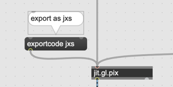
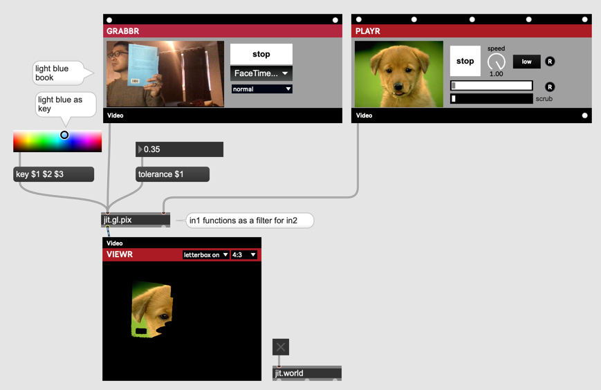
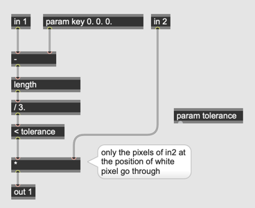
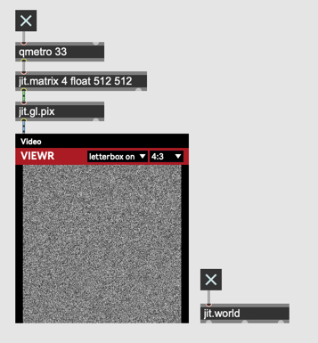
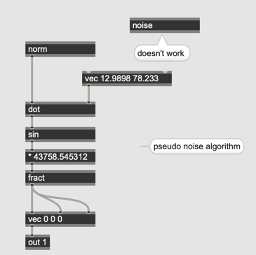
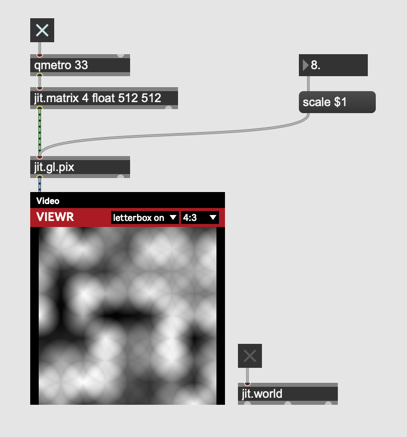
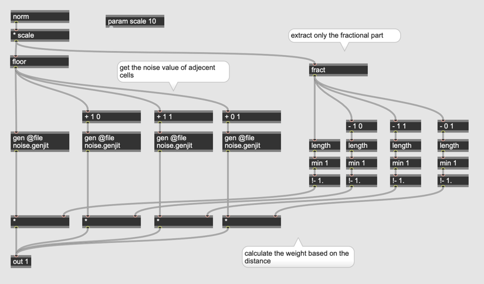
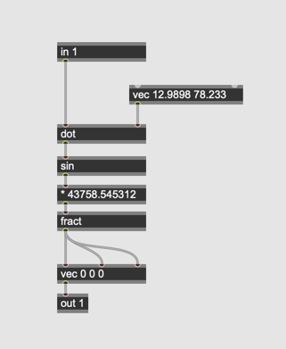
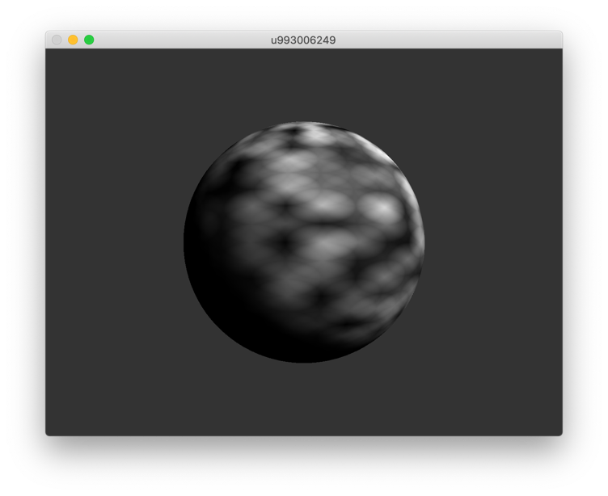

# Hardcore Video Processing (2)

## Shader Programmierung in gen

## Schritt 1 : Scale


### export




wenn jit.gl.pix bekommt "exportcode jxs" message, erzeugt das Object eine jxs-Datei.

```
<jittershader name="jit.gen.jxs">
	<description>
		code generated JXS file
	</description>
	<param name="scale" type="float" default="0.0"  />
	<param name="tin1" type="int" default="0" description="in1"/>
	<param name="dim1" type="vec2" default="1. 1." />
	<language name="glsl" version="1.0">
		<bind param="scale" program="fp" />
		<bind param="tin1" program="fp" />
		<bind param="dim1" program="vp" />
		<program name="vp" type="vertex">
<![CDATA[
uniform vec2 dim1;
varying vec2 texcoord1;
varying vec2 flip1;
varying vec2 flip1_offset;
varying vec2 texdim1;
void main() {
	texcoord1 = vec2(gl_TextureMatrix[0]*gl_MultiTexCoord0);
	texdim1 = vec2(gl_TextureMatrix[0][0][0],gl_TextureMatrix[0][1][1]);
	flip1 = texdim1/abs(texdim1);
	flip1.y *= -1.;
	flip1_offset = vec2(0., abs(min(flip1.y, 0.)));
	texdim1 = abs(texdim1);
	gl_Position = ftransform();
}
]]>
		</program>
		<program name="fp" type="fragment">
<![CDATA[

#define hypot(x, y) sqrt(x*x+y*y)
#define xor(x, y)	((!(x&&y))&&(x||y))
#define sinh(x)		(0.5*(exp(x) - exp(-x)))
#define cosh(x)		(0.5*(exp(x) + exp(-x)))
#define tanh(x)		((sinh(x))/(cosh(x)))
#define asinh(x)	(log(x) + sqrt(x*x+1.))
#define acosh(x)	(log(x) + sqrt(x*x-1.))
#define atanh(x)	(0.5*log((1.+x)/(1.-x)))
#define trunc(x)	(vec4(x.r > 0. ? floor(x.r) : ceil(x.r), x.g > 0. ? floor(x.g) : ceil(x.g), x.b > 0. ? floor(x.b) : ceil(x.b), x.a > 0. ? floor(x.a) : ceil(x.a)))

vec2 jit_wrap1(vec2 v) {
	return mod(v, 1.);
}

vec2 jit_clamp1(vec2 v) {
	return clamp(v, 0., 1.);
}

vec2 jit_mirror1(vec2 v) {
	return 1.-abs((mod(v, 2.)-1.));
}

uniform float scale;
uniform samplerJit0 tin1;

varying vec2 texcoord1;
varying vec2 flip1;
varying vec2 flip1_offset;
varying vec2 texdim1;

void main() {
	vec4 in1 = textureJit0(tin1, texcoord1);
	vec4 mul_24 = (in1 * scale);
	gl_FragData[0] = mul_24;
}
]]>
		</program>
	</language>
</jittershader>
```

## Schritt 2 : Addition


## Schritt 3 : Hue Shift


## Schritt 4 : Texture Sampling


## Schritt 5 : Wave Effect


## Schritt 6 : Binarization


## Schritt 7 : Farbe als Maske






## Schritt 8 : Checker Pattern


## Schritt 9 :  Noise







## Schritt 10 : Interpolated Noise









## Aufgabe 

Programmieren Sie ein Patch, das ein Sphere mit ein jit.gl.pix~ generiete Texture zeigt.




