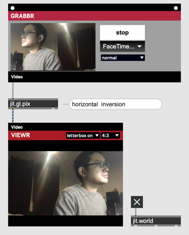
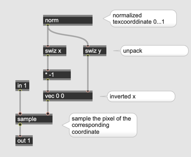
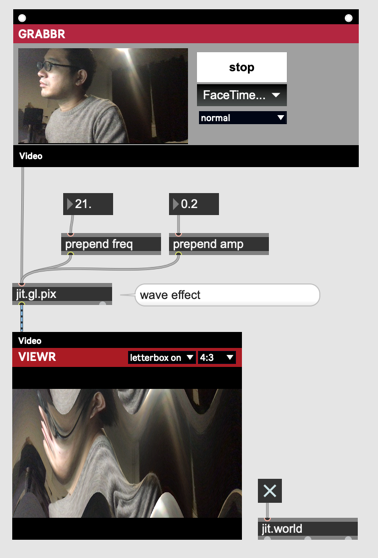
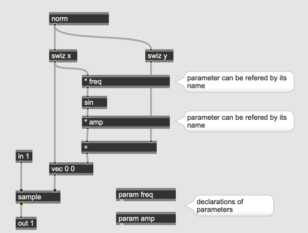
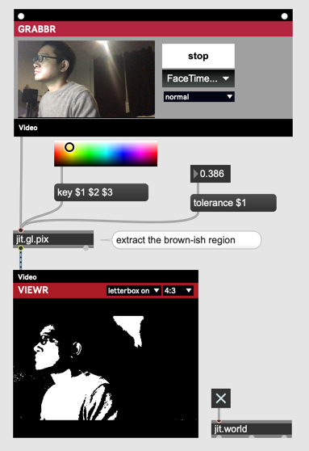
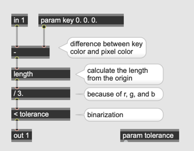
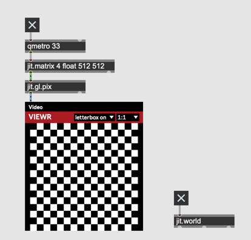
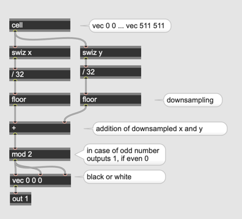

# Hardcore Video Processing (2)

## Shader Programmierung in gen

## Schritt 1 : Scale

## Schritt 2 : Addition

## Schritt 3 : Hue Shift

## Schritt 4 : Texture Sampling

## Schritt 5 : Wave Effect

## Schritt 6 : Binarization

## Schritt 7 : Farbe als Maske

## Schritt 8 : Checker Pattern

## Schritt 9 : 

