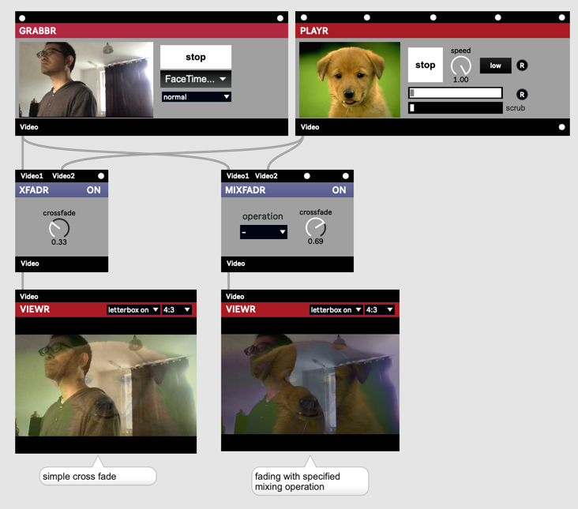
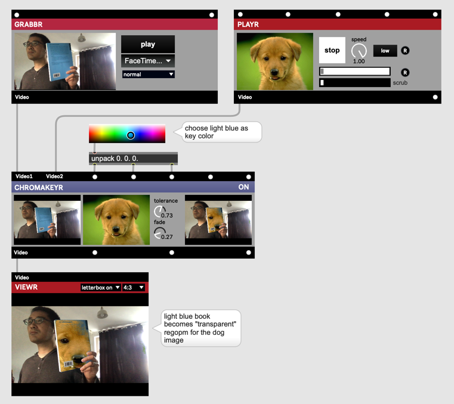

# Vizzie

##### Jitter Tip : Jitter verwendet zu viel CPU

- Die Wiedergabe von eine Videodateien (1920 x 1080 Full HD) kostet 40% von CPU
 

- Ohne jit.pwindow ca' 15% weniger

- @output_texture 1 verwendet OpenGL (Grafikkarte) f￿ür Videowiedergabe 

- aber mit @output_texture 1, die Daten ist auf Grafikkarte, Pixel￿änderung mit z.B. jit.op ist nicht mehr m￿öglich

 
 
 
### Shader (OpenGL Shading Language)

Die OpenGL Shading Language (kurz: GLSL oder glSlang) ist eine Programmiersprache, um mittels OpenGL auf dem Grafikprozessor eigene Programme, sogenannte Shader, auszuführen.

[GLSL Sandbox](http://glslsandbox.com/)

#### Was ist Vizzie?
[Introducing Vizzie](https://cycling74.com/articles/introducing-vizzie)

## INPUT / OUTPUT

#### GRABBR

#### PLAYR / AVPLAYR

#### VIEWR

#### AVRECORDR / RECORDR / SNAPPER

#### PROJECTR

## EFFECT

## TRANSFORM

### Basic

### Advanced

## MIX-COMPOSITE

### OPER8R

### XFADDR/MIXFADR

### CHROMAKEYR

### 4MIXR

## GENERATE

### 1EASEMAPPR / 3EASEMAPPR / EASEMAPPR

### 1PATTERNMAPPR / 3PATTERNMAPPR / PATTERNMAPPR

### ANALYZR

### Tipp
Vizzie ist eine Sammlung von Patchers.
Man kann Vizzie-Module als ein Patcher benutzen.

