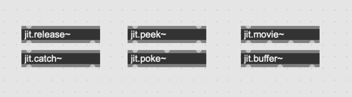
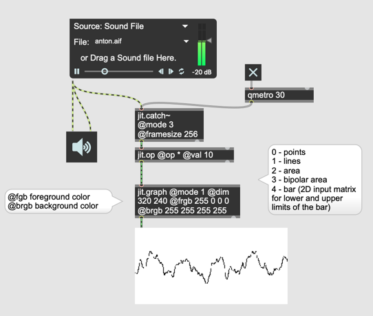
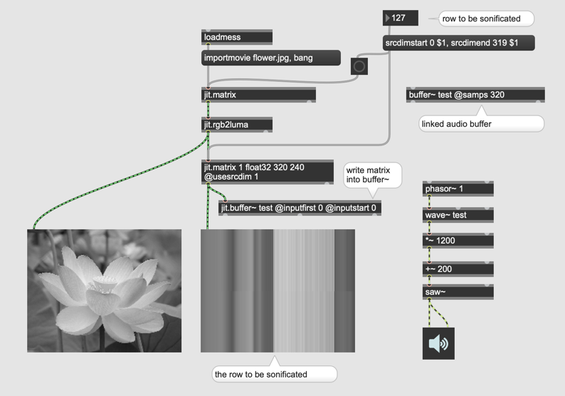
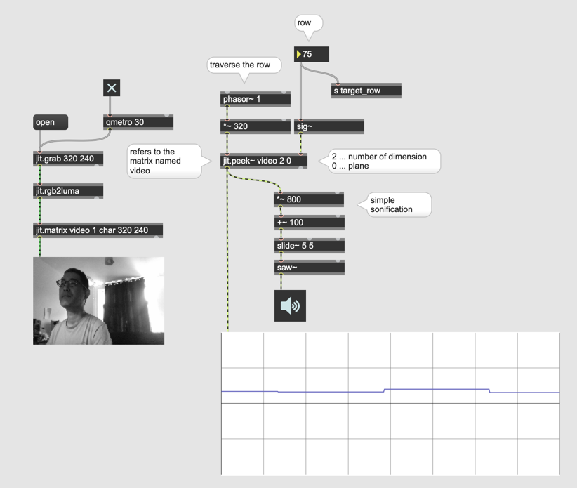
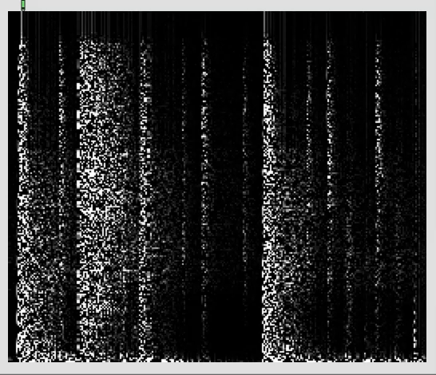
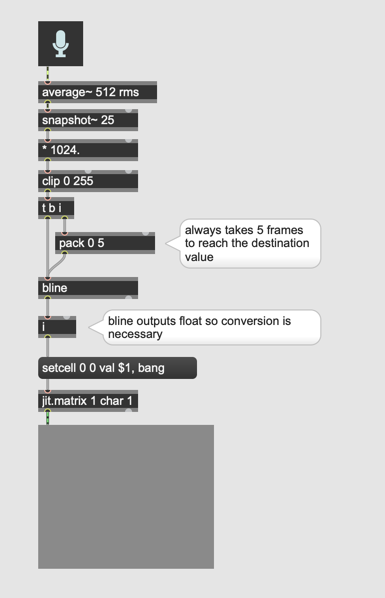

# Audio und jitter

##### Tilde Objekte in jitter

#### Movie mit audio

- jit.movie~

#### Signal -> Matrix

- jit.catch~

@mode
1. all data since the last output is output in a one-dimensional matrix.
2. the amount of buffered data that fits into a multiple of the framesize is output in two dimensions; data not output will be saved for the next time.
3. a framesize of the most recent data is output.
4. causes jit.catch~ to behave like an oscilloscope, triggering on channel trigchan when the signal crosses triglevel in the direction trigdir. If the threshold has not been passed for the duration of the entire internal data buffer (100 ms)

#### Wellenform in Matrix

- jit.graph

#### Matrix -> Signal

- jit.release~

#### Audio Buffer -> Matrix

- jit.buffer~

#### Matrix -> Audio Buffer

#### Pixel als Audio Sample

- jit.peek~

#### Audio Sample als Pixel

- jit.poke~

#### Aufgabe 1: Spectrum

Programieren Sie ein Patch, das Sonogram (Spektrogram) mit jitter verwirklicht.

#### Pegelvisualisierung

#### Interpolation mit bline

