# Live-Video und Jitter

##### Jitter Tipp: "Auto Fix Width" Deaktivieren

- in einem jitter Objekt muss man oft viele Attribute schrieben

- wenn diese Attribute bearbeitet wird, korrigiert Max automatisch die Gr￿öße des Objektes

- Aber wenn "Auto Fix Width" deaktiviert ist, korrigiert Max die Gr￿öße nicht mehr.

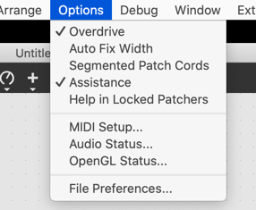

#### Bild Analyse

- jit.iter

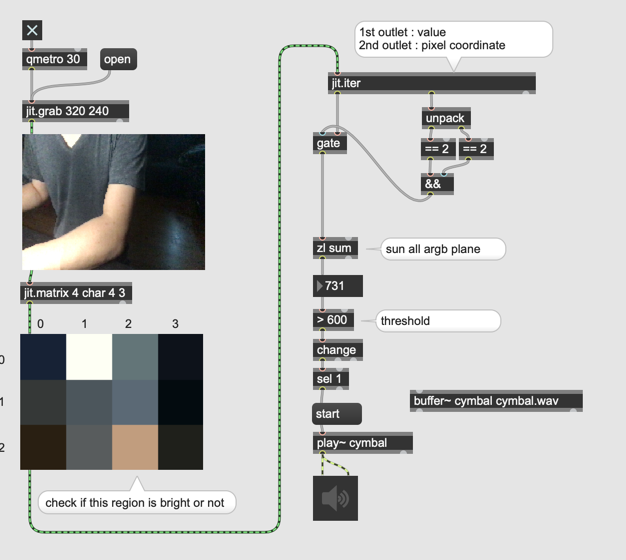

#### Video Aufnahme

- jit.matrixset

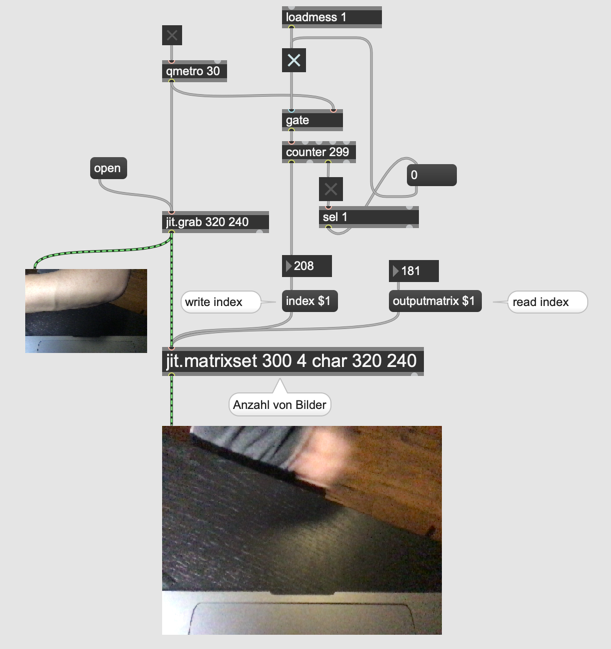

#### Video Delay

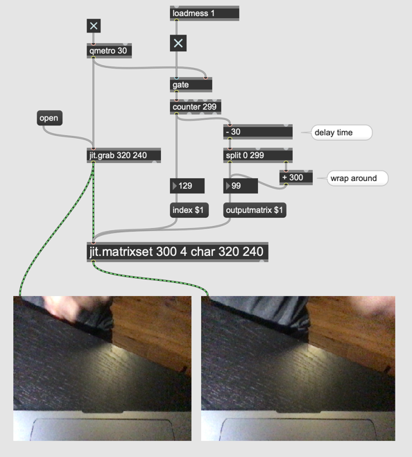

#### Feedback Delay

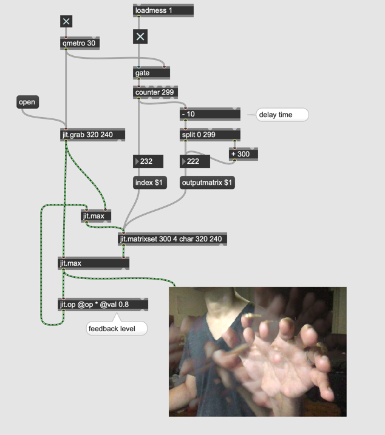

#### Aufgabe 1

Programmieren Sie ein Patch, das folgende Zusammengestellte Live-Video erzeugt.

#### Ghost Effekt

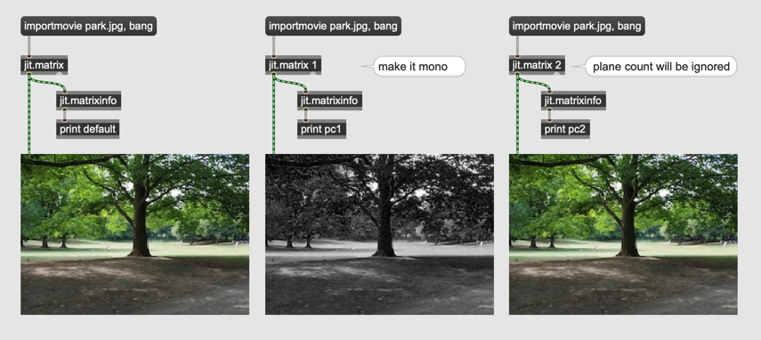

#### Chromakey

#### Live-Binarization

jit.rgb2luma

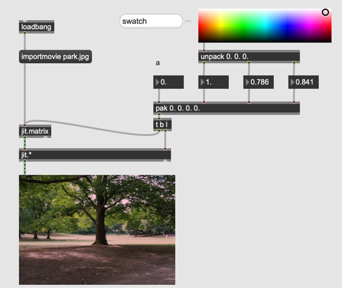

#### Live-Maskierung

- playbar

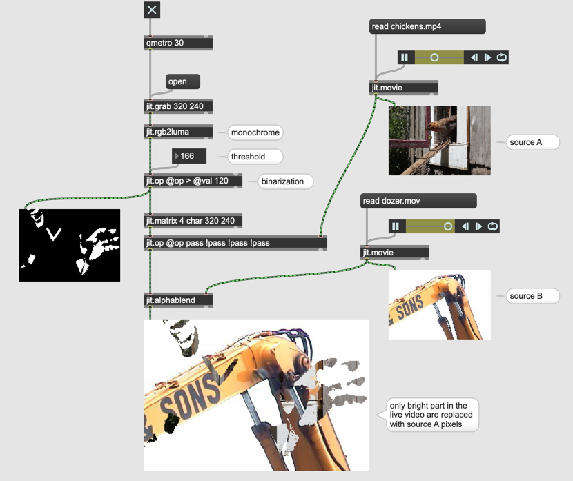

#### Frame Delta und Bewegungserkennung

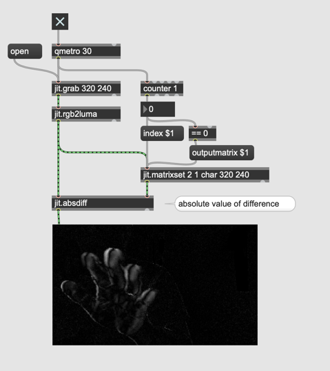

#### mit Feedback

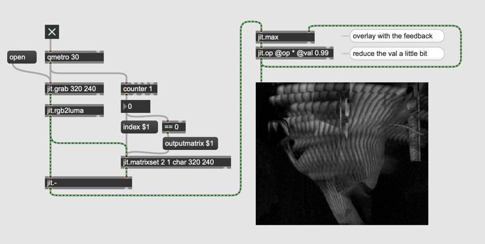

#### Aufgabe 2

Programmieren Sie ein Patch, indem die Differenz zwischen Bilder (mit feedback) als Chroma-Key verwendet wird.

#### Bewegung als Wert

- jit.m3

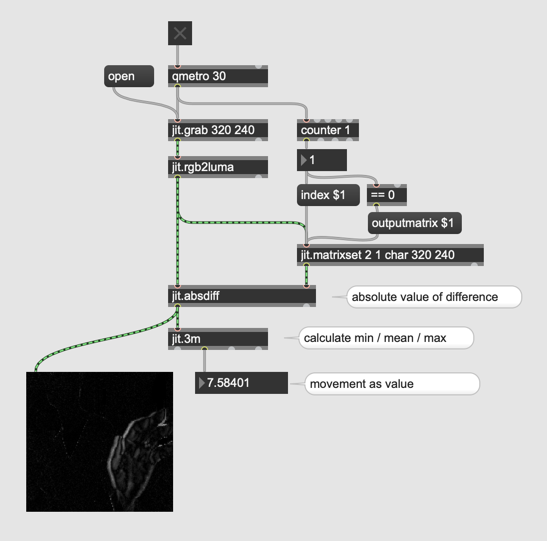

#### Video Umwanderung in jitter

###### LUMINANCE

###### AYUV

###### UYVY
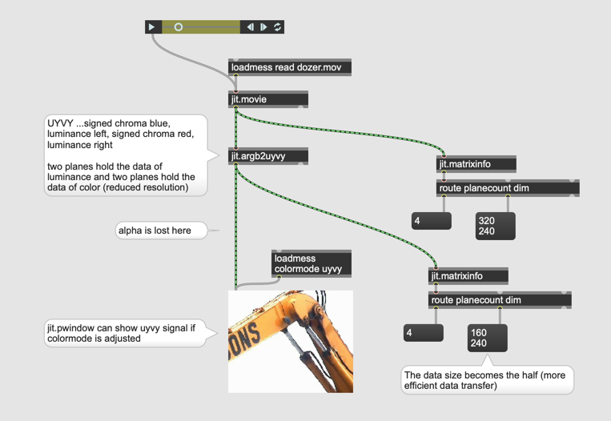

jit.movie akzeptiert auch @colormode (aber jit.pwindow mit uyvy ist sehr aufwendig f￿ür CPU)

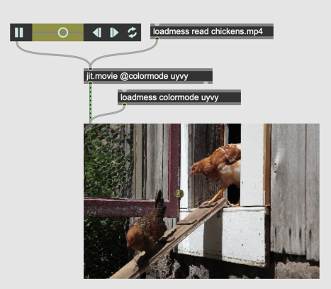

