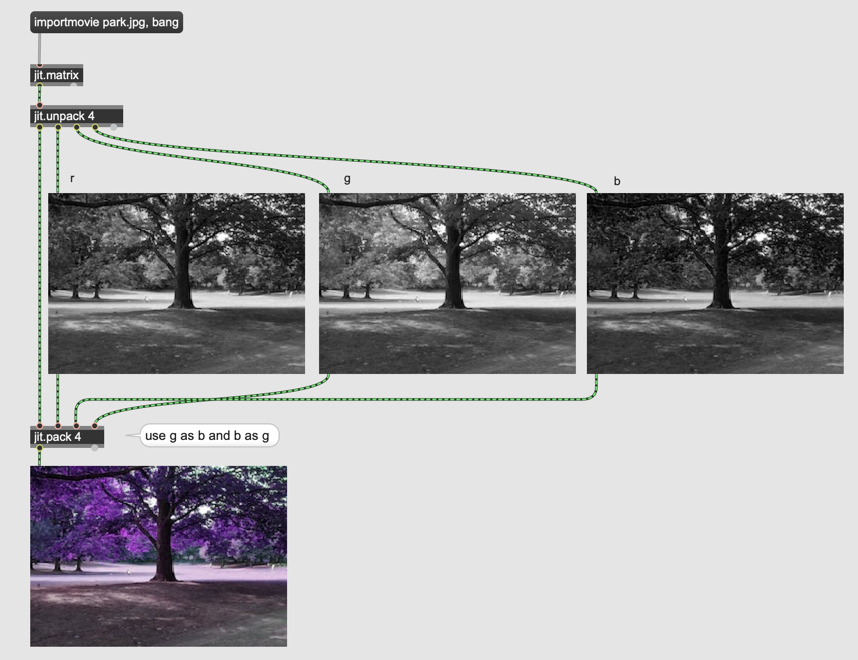

# Matrix and planes

### Arithmetic

- jit.+ 
- jit.* 

#### Assignment 1

using jit.*, create apply the 5-seconds fade-in effect to the following [image](K2/flower.jpg).

### Import

- jit.matrixinfo ... for checking the information of the matrix

#### Assignment 2
Check the matrix properties of the flower image using jit.matrixinfo

### Arithmetic operation for individual planes

It is possible to apply different numbers to each plane.

#### Assignment 3

Using jit.*, filter out red and blue component of the flower image and show only green component in jit.pwindow

#### Swatch

- swatch

useful to intuitively pick RGB values

### Scaling and Addition

### Plane separation

- jit.unpack
- jit.pack

With these objects, we can separate planes in one matrix and handle them separately

#### Assignment 4

Separate the planes of the matrix that contains the flower image, using jit.unpack and check the properties of the "unpacked" matrix using [jit.matrixinfo]

pack the planes again and check the properties of "packed" image again using [jit.matrixinfo]

