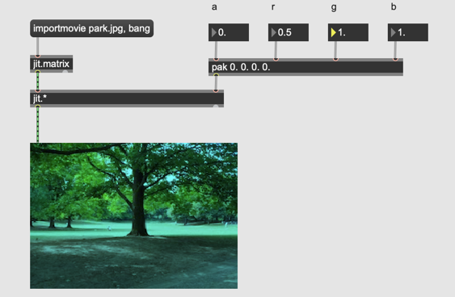

# Basic (2)

#### Arithmetic

- jit.+
- jit.*

#### Import

- jit.matrixinfo

#### Arithmetic operation for individual planes

#### Swatch

- swatch

#### Scaling und Addition

#### Exchange

- jit.unpack
- jit.pack

#### Video data

- jit.qt.movie

#### Metro for Video

- qmetro

#### Window for Video

#### Resolution change

#### Different Resolutions and arithmetic operation

#### One part of the source

#### One part of the matrix

#### Assignment

Programmieren Sie ein Patch das folgende Bild erzeugt.

