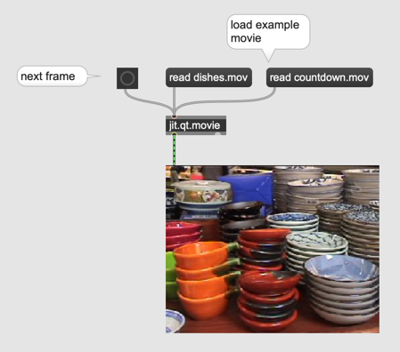

# Live-Video und Jitter

##### Jitter Tipp: "Auto Fix Width" Deaktivieren

- in einem jitter Objekt muss man oft viele Attribute schrieben

- wenn diese Attribute bearbeitet wird, korrigiert Max automatisch die Gr￿öße des Objektes

- Aber wenn "Auto Fix Width" deaktiviert ist, korrigiert Max die Gr￿öße nicht mehr.

#### Bild Analyse

- jit.iter

#### Video Aufnahme

- jit.matrixset

#### Video Delay

#### Feedback Delay

#### Aufgabe 1

Programmieren Sie ein Patch, das folgende Zusammengestellte Live-Video erzeugt.

#### Ghost Effekt

#### Chromakey

#### Live-Binarization

jit.rgb2luma

#### Live-Maskierung

- playbar

#### Frame Delta und Bewegungserkennung

#### mit Feedback

#### Aufgabe 2

Programmieren Sie ein Patch, indem die Differenz zwischen Bilder (mit feedback) als Chroma-Key verwendet wird.

#### Bewegung als Wert

- jit.m3

#### Video Umwanderung in jitter

###### LUMINANCE

###### AYUV

###### UYVY

jit.movie akzeptiert auch @colormode (aber jit.pwindow mit uyvy ist sehr aufwendig f￿ür CPU)

