# Basic (3)

### Fade in/out

- jit.xfade

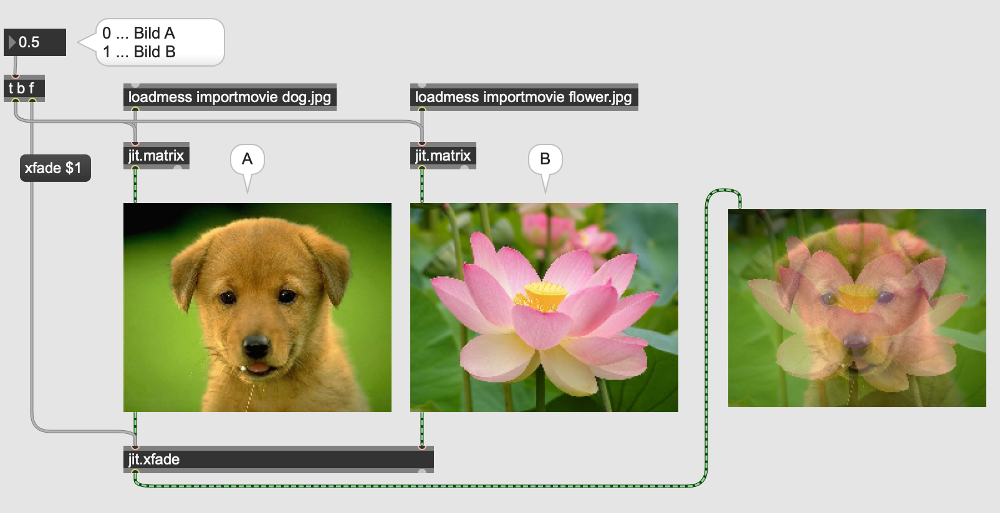

### Photoshop Effects

- jit.op

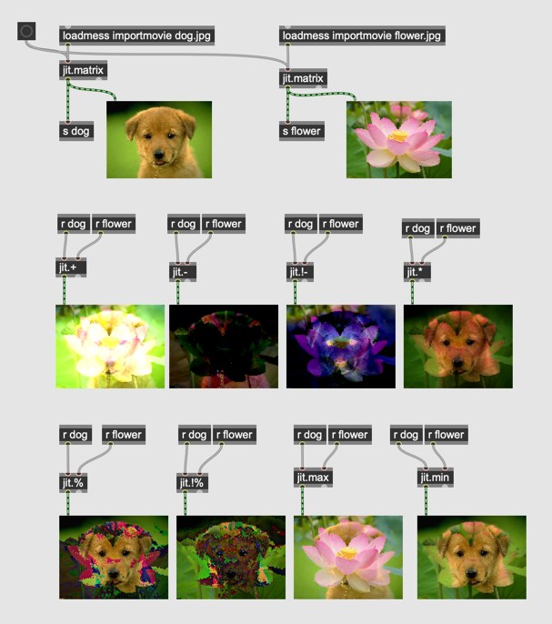

#### Assignment 1
Use 3 images on your computer and mix them using 2 different jit.op objects

### Scissors and glue

- jit.scissors
- jit.glue

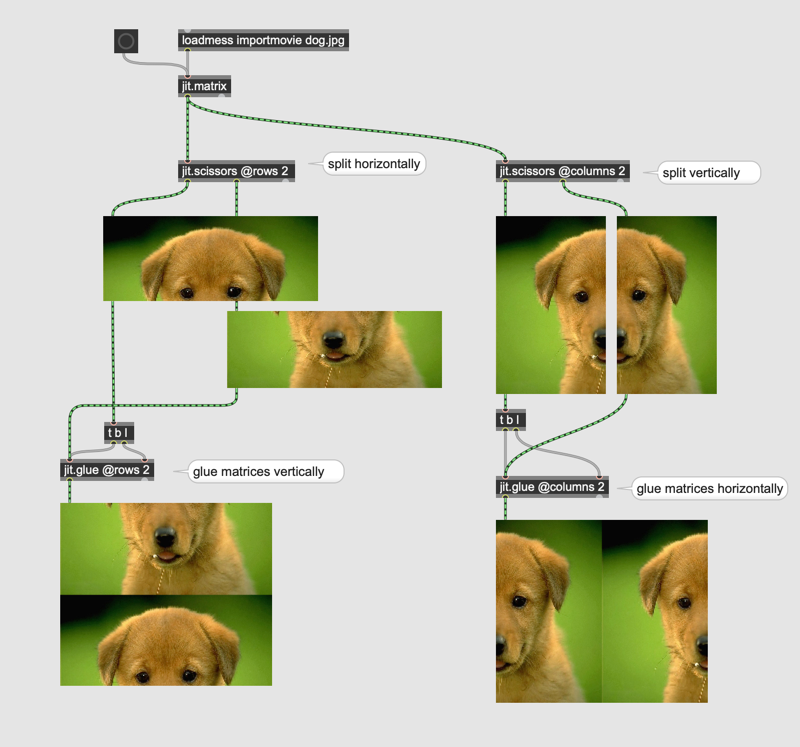

#### Assignment 2
Realize the following image using scissors and glue.

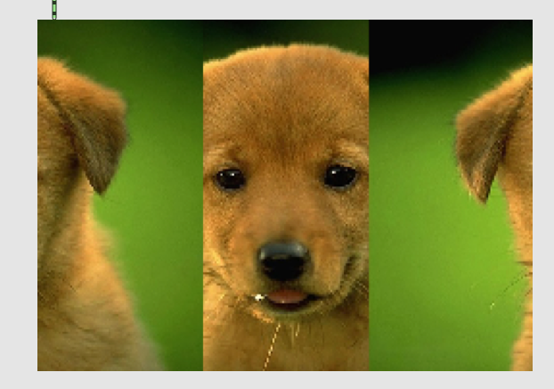

### Affine transformation

- jit.rota

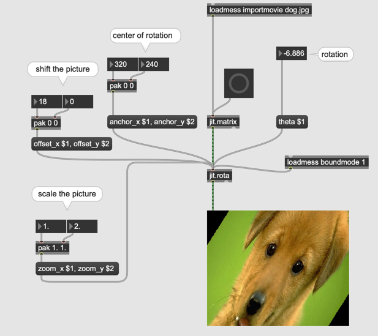

#### Assignment 3

Realize the following image using jit.rota
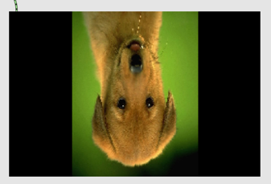

#### Alpha

an image with alpha

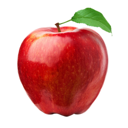

The background of this apple is not white but transparent so that we can put this apple image on top of another image.

##### Alpha analyse in Max Patch

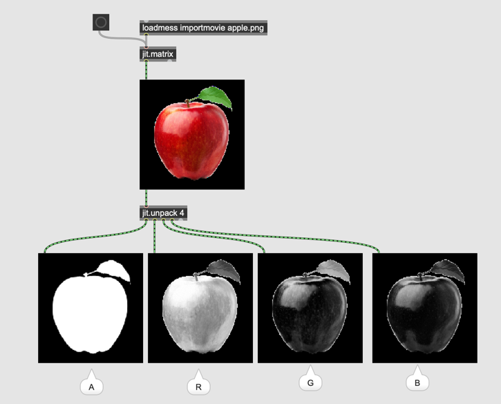

As you can see, the apple is filled with value 255 in the alpha channel. This means this part of the image is completely opaque but the rest is totally transparent.

##### Image without alpha

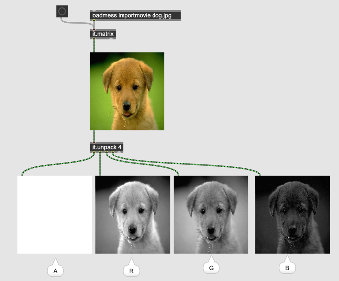

##### Alpha Blending

- jit.alphablend

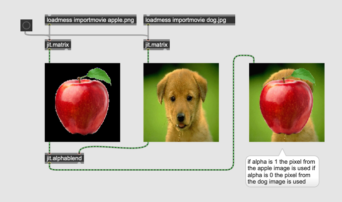

#### Assignment 3

Program a patch that realizes PnP (Picture in Picture) effect as the screenshot below.

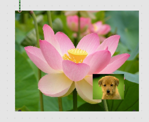

