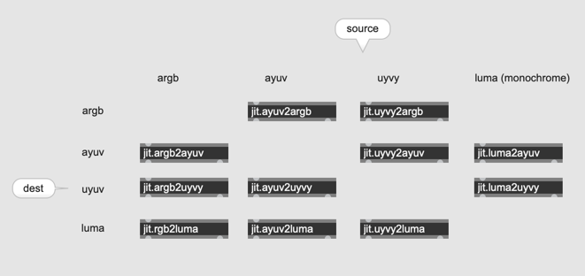
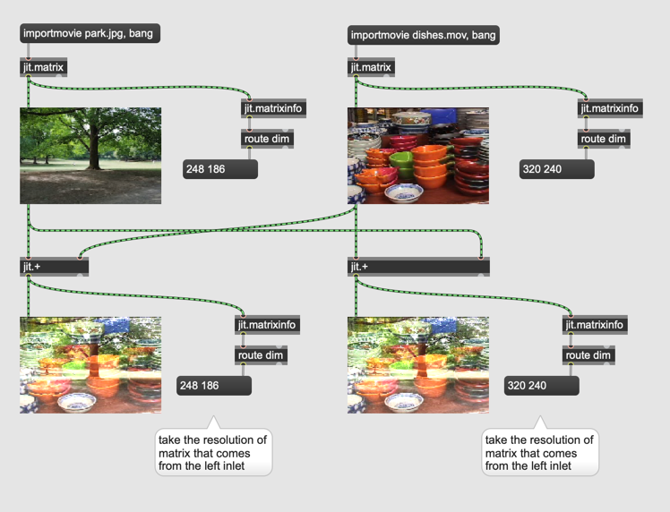
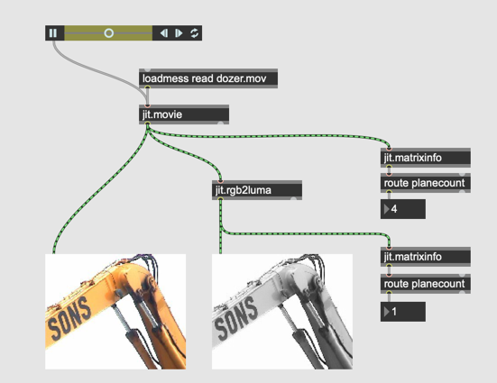
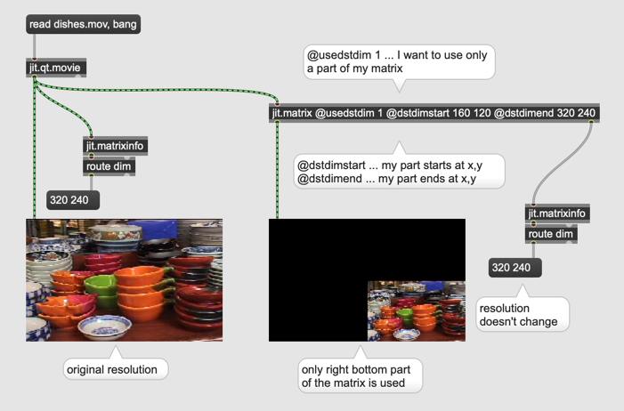
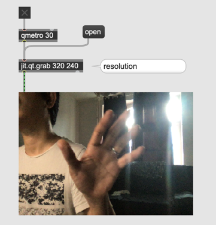
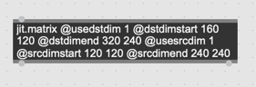
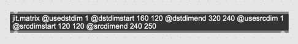
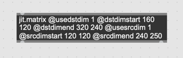

# Video Data Handling

#### Resolution change

#### Different Resolutions and arithmetic operation

#### One part of the source

#### One part of the matrix

#### Video Camera

##### Jitter Tip: "Auto Fix Width" Deactivation

- in a jitter object we have to write a lot of attributes in the box

- When these attributes are added, Max automatically corrects the size of the object

- But when "Auto Fix Width" is disabled, Max no longer corrects the size.

