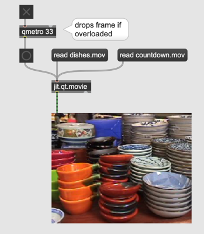

# Video Data Handling
- jit.qt.movie

#### Metro for Video

- qmetro

#### Window for Video

#### Resolution change

#### Different Resolutions and arithmetic operation

#### One part of the source

#### One part of the matrix

#### Assignment

Program a patch that produces the following image.

#### Video Camera

