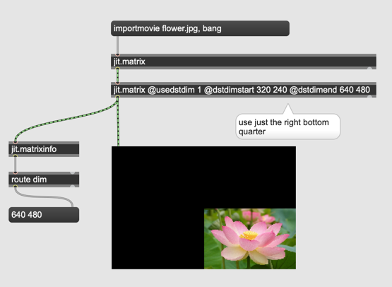

# Resizing Matrices

### Downsampling

#### Assignment 1
Change the size of [40 30] to different values such as [320 240] [5 480] [640 120] and observe how jitter processes the image.

#### Assignment 2
Until now, we pass jit.+  only the matrices that have the same size.

- Load [flower image](K4/flower.jpg) (640 x 480) and [Dog Image](K4/dog.jpg) (320 x 240) on to a max patch 
- observe the result of addition with two images with different sizes in jit.pwindow
- check the resolution of the added image using jit.matrixinfo
- swap the inlets for flower image and dog image and check again

### Automatic size adjustment
As we observe in the assignment 2
- jitter uses the size of matrix that arrives to the left inlet. The matrix comes in from the right inlet will be resized.

### Zooming

we can use just one part of incoming matrix using @usesrcdim. The size of the matrix is kept intact.

#### Assignment 3

The example above trims the right bottom quarter. Change that to the **left top** quarter.

### Offsetting

We can also use a matrix to create offsets using @usedstdim

#### Assignment 4

place the right top quarter of the flower image at the left bottom quarter of the matrix. The remaining part of the matrix should be filled with black.

Hint: you need to combne usedstdim and usesrcdim.

#### Assignment 5 

add the dog image at the center of the flower image.

#### Assignment 6 (Advanced)

Place the dog image at the center of the flower image.

----

##### Jitter Tip: "Auto Fix Width" Deactivation

- in a jitter object we have to write a lot of attributes in the box

- When these attributes are added, Max automatically corrects the size of the object

- But when "Auto Fix Width" is disabled, Max no longer corrects the size.

