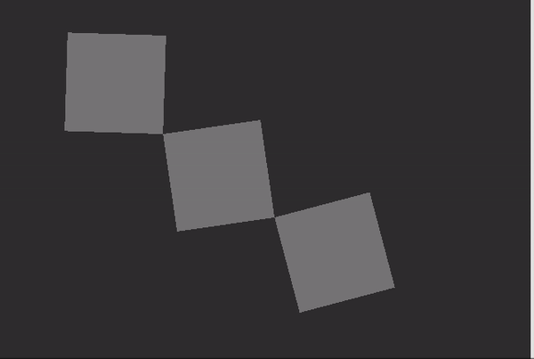

# 3D mit OpenGL (1) - Basis

## OpenGL

OpenGL (Open Graphics Library; deutsch Offene Grafikbibliothek) ist eine Spezifikation einer plattform- und programmiersprachenübergreifenden Programmierschnittstelle (API) zur Entwicklung von 2D- und 3D-Computergrafikanwendungen. Der OpenGL-Standard beschreibt etwa 250 Befehle, die die Darstellung komplexer 3D-Szenen in Echtzeit erlauben. 

## XYZ in OpenGL

OpenGL Koordinatensystem

### OpenGL in jit.pwindow
- jit.gl.render

### Die Farbe der Hintergrund

#### Primitives
- jit.gl.gridshape

#### Position

Default:  
Camera Position [0 0 2]  
Camera LookAt [0 0 0]

#### Andere Formen

#### Licht

#### Smooth Shading 

#### Noch weicher machen

#### Affine Transformationen

#### Rotation XYZ

#### Anchor und Rotation

#### Handle

- jit.gl.handle

- Click and drag ... Rotation
- Alt+drag ... z Movement
- Cmd+drag ... xy Movement

#### Aufgabe 1 : ein Spinnendes Objekt

Programmieren Sie ein Patch, das ein spinnendes Objekt (Torus) wie das untenstehende Video zeigt.

#### Farbe

#### Farbe in OpenGL

#### Position des Lichtes

- jit.gl.light

#### Texture Mapping

Der Begriff Texture Mapping (deutsch etwa „Musterabbildung“) bezeichnet ein Verfahren der 3D-Computergrafik. Es dient dazu, die Flächen dreidimensionaler Oberflächenmodelle mit zweidimensionalen Bildern – sogenannten „Texturen“ – und Oberflächeneigenschaften auszustatten. Texturen lassen computergenerierte Bilder detailreicher und realistischer erscheinen, ohne dass das zugrundeliegende Modell selbst verfeinert werden muss.

#### Texture mit/ohne Licht 

#### Video als Texture

#### Zweite Model in der Szene

#### Camera Kontrol

- jit.gl.camera

#### Gruppierung mit node

- jit.gl.node  

#### Hierarche mit node

#### Aufgabe 2 Shulter - Ellbogen - Handgelenk

Programmieren Sie ein Patch, das die Hierarchie von Schulter, Ellbogen und Handgelenk simuliert.

