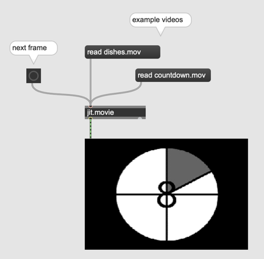
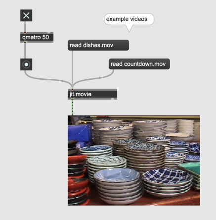
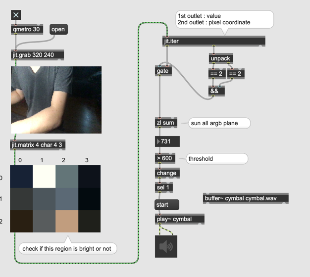
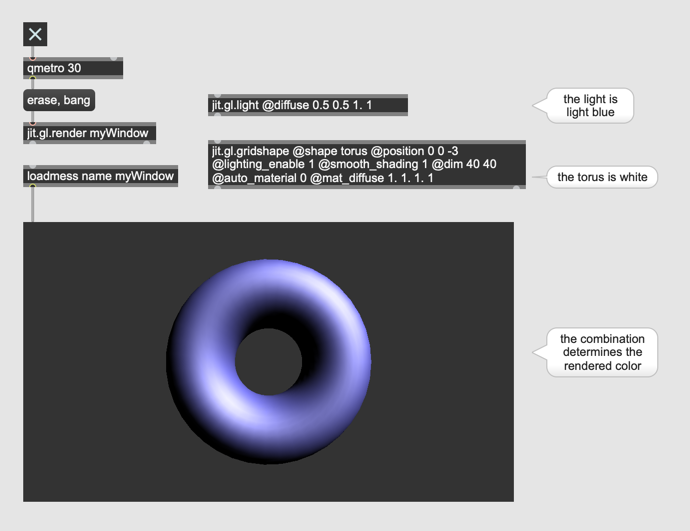
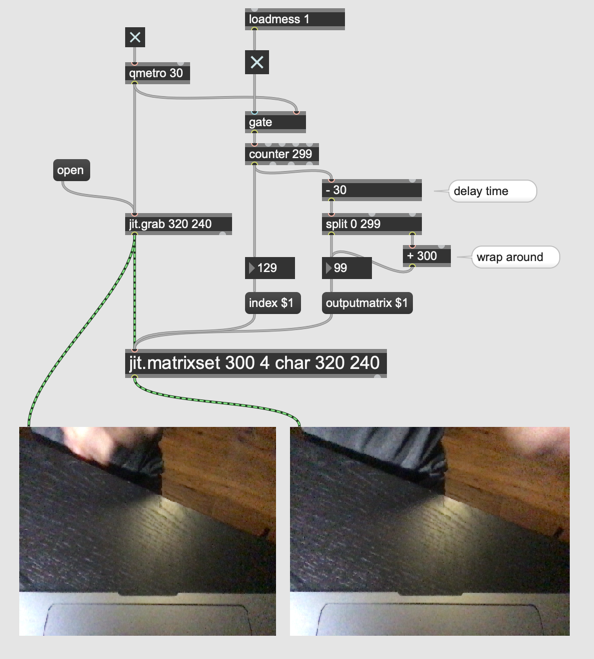
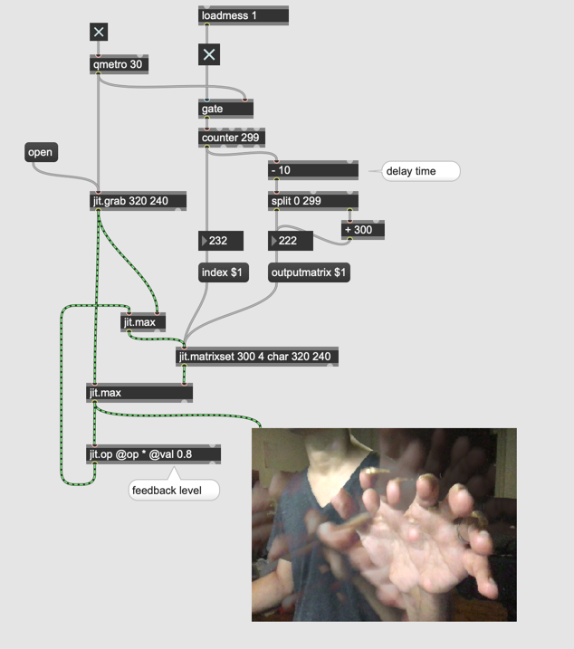

# Video processing in Jitter

- jit.movie

#### Metro for Video

- qmetro

#### Picture Analysis

- jit.iter

#### Video recording

- jit.matrixset

#### Video Delay

#### Feedback Delay

#### Assignment 1

Program a patch that produces the following composite live video.

Hint: scissors + glue

