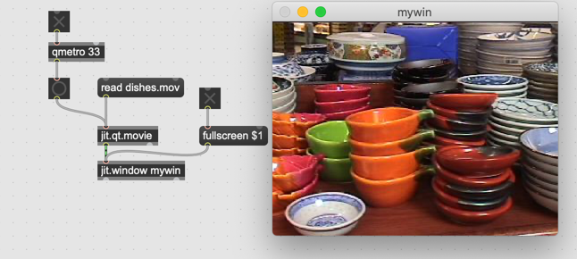
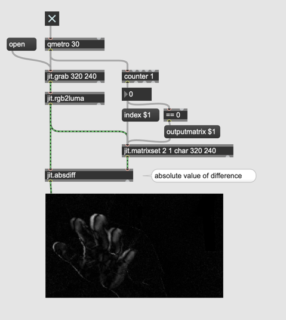
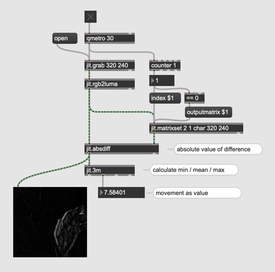
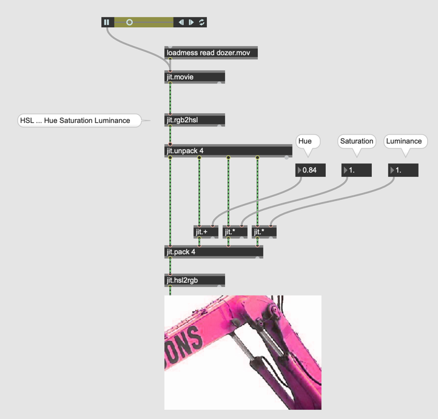

# Live-Video and Jitter

- jit.qt.movie

#### Metro for Video

- qmetro

#### Window for Video

#### Picture Analysis

- jit.iter

#### Video recording

- jit.matrixset

#### Video Delay

#### Feedback Delay

#### Assignment 1

Program a patch that produces the following composite live video.

Hint: scissors + glue

#### Ghost effect

#### Chromakey

#### Live-binalization

jit.rgb2luma

#### Live-masking

- playbar

#### Frame Delta and motion detection

#### with Feedback

#### Assignment 2

Program a patch using the difference between images (with feedback) as the chroma key.

#### Movement as numbers

- jit.m3

#### Colorspace in Jitter

###### LUMINANCE

###### AYUV

###### UYVY

jit.movie akzeptiert auch @colormode (aber jit.pwindow mit uyvy ist sehr aufwendig f￿ür CPU)

###### HSL

