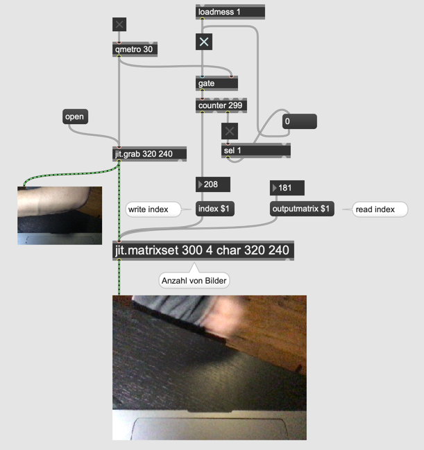

# Video processing in Jitter

- jit.movie

### Metro for Video

- qmetro

#### Assignment 1
Playback dishes.mov and countdown.mov at the same time using qmetro and add them using [jit.+]. 
The added result should be shown in a [jit.pwindow]

### Camera input

### Video recording

- jit.matrixset ... stores a sequence of matrices

#### Assignment 2: Delay effect
In the above example, if we keep the "distance" between index and outputmatrix (read and write points) constant, we can create a "delay" effect.
Implement a delay effect, using this principle.

#### Assignment 3: Feedback delay (Advanced)

In the audio world, we can create the feedback delay effect, by **attenuating delay line** and **add** the delay line to input.

Implement the feedback delay effect by applying the same principle.

Hint: jit.* ... attenuation / jit.+ ... addition

#### Assignment 5

Program a patch that produces the following composite live video.

Hint: scissors + glue

### Video analysis

By downsampling the video image, we can check the brightness and color of the specific part of the image.

#### Assignment 6

Program a patch that triggers [a sound sample](K5/cymbal.wav), when the right-bottom corner of the video image becomes brighter than a specific value (e.g. 200).

Hint: 
- Review K1 for pixel value checking
- Brightness can be calculated by (R + G + B) / 3
- Use [change] object to avoid successive triggering
- [>] object may be helpful
