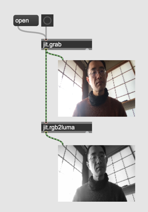
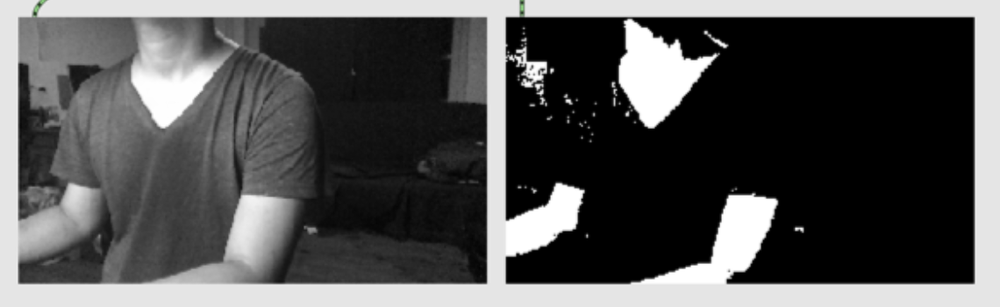

# Further Video Processing

### Ghost effect

Delay + max or min

#### Assignment 1
Replace [jit.max] or [jit.min] with different operation using [jit.op] to explore more blending possibilities

### Chromakey

- jit.chromakey

Allows you to replace pixels with specified color with pixels from another matrix.

#### Assignment 2
Replace the dog image in the patch above with a movie.

### Monochrome

- jit.rgb2luma ... makes the incoming matrix monochrome

#### Assignment 3
Find a way to binarize (make the image just black or white with no grays at all) the monochrome matrix.

Hint: jit.op 

#### Assignment 4 : Live masking (Advanced)

Binarization can be used as a mask.
In the following example, the matrix coming from [jit.grab] is binarized 

In addition to the video stream from [jit.grab], there are two more video streams from [jit.movie]

If the pixel in the binarized image is white, a corresponding pixel from movie A is taken and if it is black, a corresponding pixel from movie B is taken.

As a result, we create a "peeled wallpaper" image but where to be peeled is up to video input.

Implement the hidden part of the patch to realize the effect.

Hint: 
- jit.alphablend 
- we can create swap the alpha plane of the movie A using jit.op
- Study jit.op @op pass and !pass

### Frame Delta and motion detection

Frame delta ... the different between current and previous video frame

#### with Feedback

#### Assignment 5

Program a patch using the difference between images (with feedback) for the "peeling" effect implemented in Assignment 4.

### Movement as numbers

- jit.m3 ... calculate min, mean, max of all pixels

#### Assignment 6

Control the volume of [noise~] by the hand movement. The more you move the hand, the louder the noise becomes.

