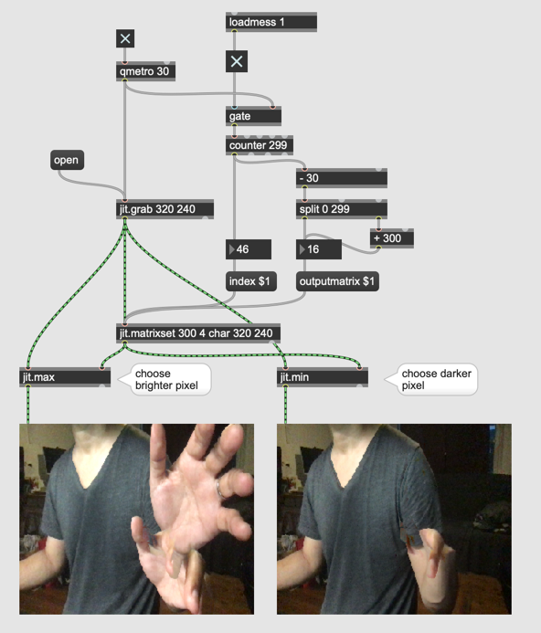
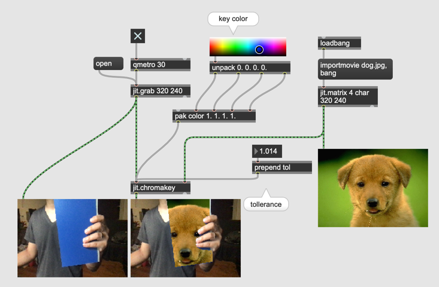
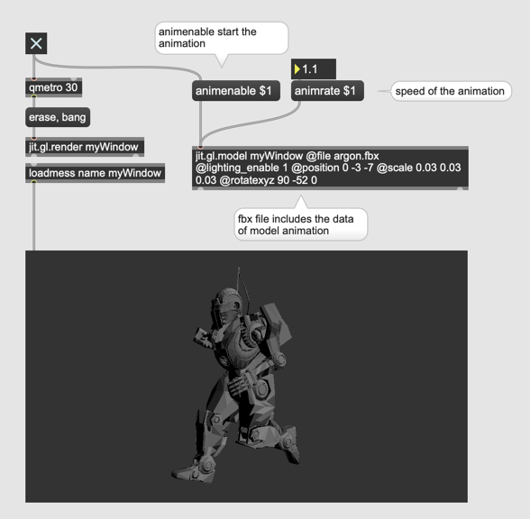
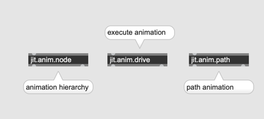
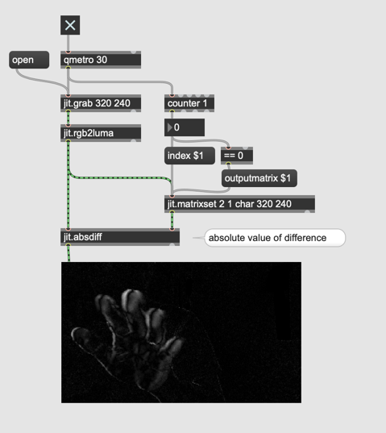
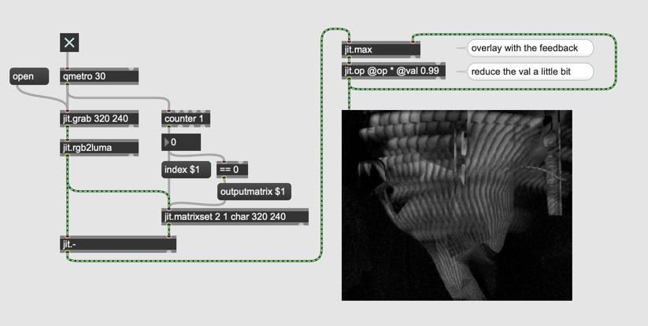

#### Live Video 

#### Chromakey

#### Live-binalization

jit.rgb2luma

#### Live-masking

- playbar

#### Frame Delta and motion detection

#### with Feedback

#### Assignment 2

Program a patch using the difference between images (with feedback) as the chroma key.

#### Movement as numbers

- jit.m3

