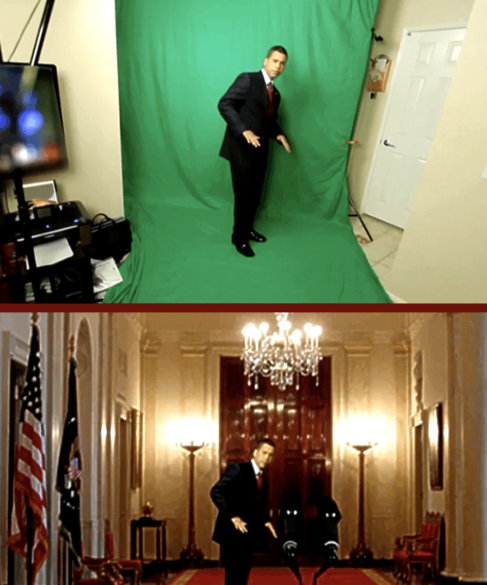

# Further Video Processing

### Ghost effect

Delay + max or min

#### Assignment 1
Replace [jit.max] or [jit.min] with different operation using [jit.op] to explore more blending possibilities

### Chromakey

- jit.chromakey

Allows you to replace pixels with specified color with pixels from another matrix.

#### Assignment 2
Replace the dog image in the patch above with a movie.

### Monochrome

- jit.rgb2luma ... makes the incoming matrix monochrome

#### Assignment 3
Find a way to binarize (make the image just black or white with no grays at all) the monochrome matrix.

#### Live-masking

- playbar

#### Frame Delta and motion detection

#### with Feedback

#### Assignment 3

Program a patch using the difference between images (with feedback) as the chroma key.

### Movement as numbers

- jit.m3

#### Assignment 4

Control the volume of [noise~] by the hand movement. The more you move the hand, the louder the noise becomes.

