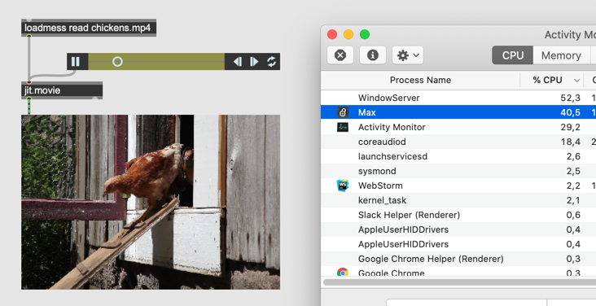
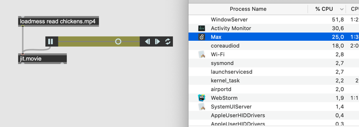
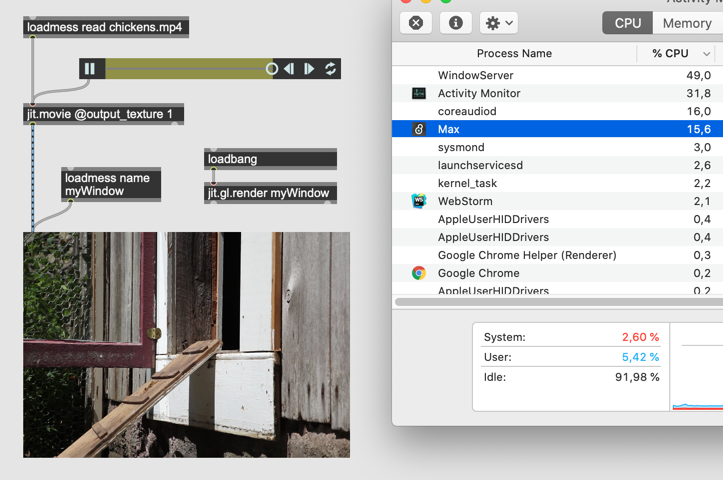
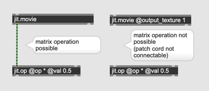

# Erster Kontakt mit Videokarte

##### Jitter Tip : Jitter verwendet zu viel CPU

- Die Wiedergabe von eine Videodateien (1920 x 1080 Full HD) kostet 40% von CPU
 

- Ohne jit.pwindow ca' 15% weniger

- @output_texture 1 verwendet OpenGL (Grafikkarte) f￿ür Videowiedergabe 

- aber mit @output_texture 1, die Daten ist auf Grafikkarte, Pixel￿änderung mit z.B. jit.op ist nicht mehr m￿öglich

 
 
 

## Shader (OpenGL Shading Language)

Die OpenGL Shading Language (kurz: GLSL oder glSlang) ist eine Programmiersprache, um mittels OpenGL auf dem Grafikprozessor eigene Programme, sogenannte Shader, auszuführen.

[GLSL Sandbox](http://glslsandbox.com/)

### slab

- jit.gl.slab

### jit.gl.pix

