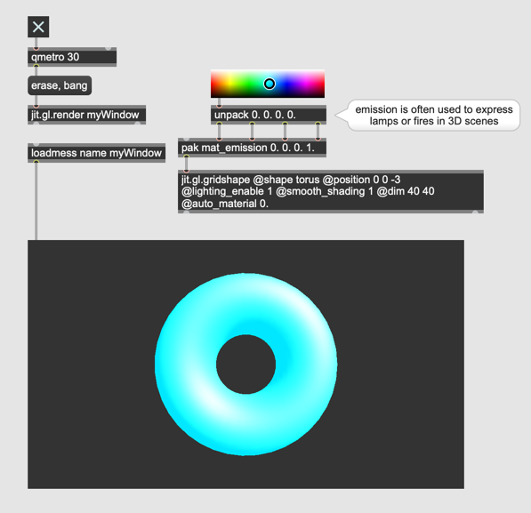
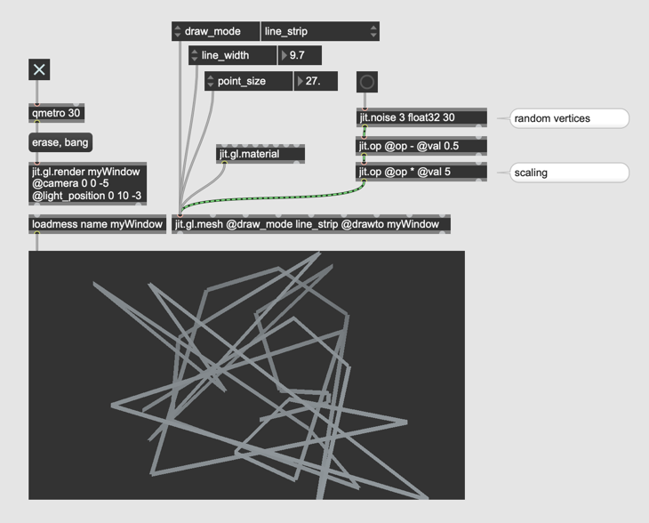

# 3D mit OpenGL (2) - Realismus

## Licht und Material

#### Phong reflection Model

Das Phong-Beleuchtungsmodell ist ein Beleuchtungsmodell in der 3D-Computergrafik, das dazu verwendet wird, die Beleuchtung von Objekten zu berechnen. Das Modell wurde nach seinem Entwickler Bùi Tường Phong benannt und erstmals 1975 vorgestellt (Illumination for Computer Generated Pictures, Juni 1975).

#### Phong Reflection Model in jitter

#### Die Farbe vom Licht * Die Farbe vom Material

#### Ambient

Ambiente Faktoren in git.gl.light sind standardm￿äßig 0 0 0 1.

#### Emission

Embission ist wie Ambient (Konstante F￿ärbung) aber unabh￿ängig von Lichtquellen

### Material Browser

- jit.gl.material

## Nebel

### Tipp : Wireframe rendering

## 3D Model Importieren 
- jit.gl.model

##### 3D Model selbst bastelln

[Blendar](https://www.blender.org/) ... eine kostenlose Software f￿ür 3D Modellbildung

##### Kompatibilit￿ät
Wavefront Object Model File
Collada Model File
Blender 3D Model File
3ds Max 3DS Model File
3ds Max ASE Model File
Stanford Polygon Library Model File
AutoCAD DXF Model File
LightWave Model File etc.

#### Model-Animation in jitter

#### Weight Parameter

## Animation in jitter

### Hierarchie

### Automatisch Animation

#### move/turn

#### moveto/springto/scaleto

### Pfad

### Mesh

