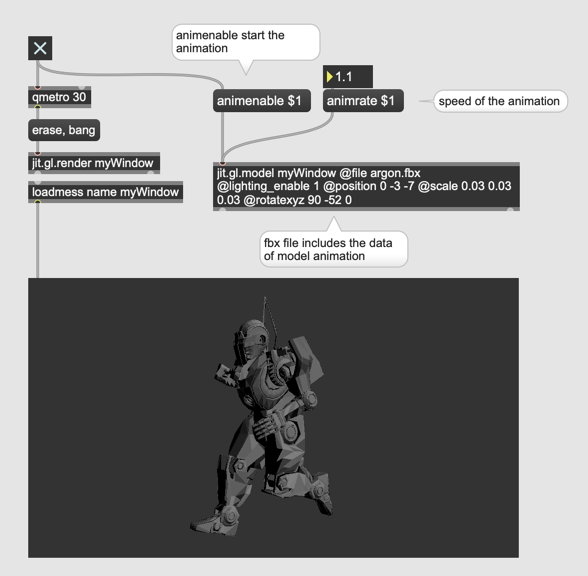

# Physik Simulation in Jitter

### Tipp

- jit.world

The jit.world object encapsulates the functionality of several jitter objects, including 
- jit.window
- jit.gl.render
- jit.gl.node
- jit.gl.cornerpin
- jit.phys.world

#### jit.window

zeigt den Inhalt von Matrix

#### jit.gl.renderer

verkn￿üpft eine OpenGL-Szene und jit.window

#### jit.gl.cornerpin

## jit.phys 

## Raum f￿ür Simulation

- jit.phys.world
- jit.gl.physdraw

## Rigid body

- jit.phys.body

## Bedienung mit Maus

- jit.phys.picker

## Globale Einstellungen und Schwerkraft

## Zwei Instanzen

## mehrere Instanzen

- jit.phys.multiple

## Unsichtbare Gegenst￿ände

## Kollision

## Kraft

- jit.phys.ghost

