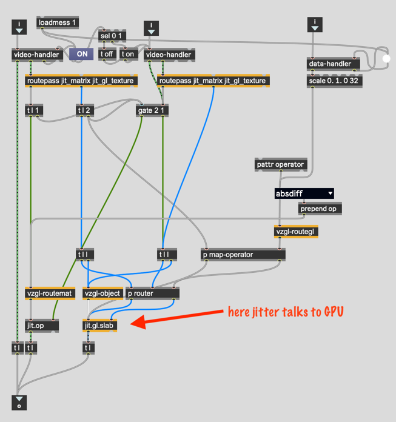
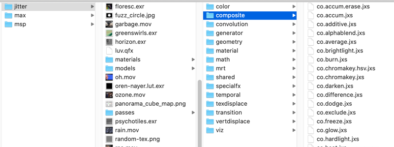
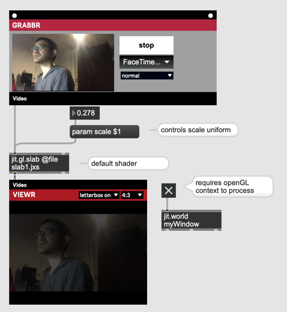
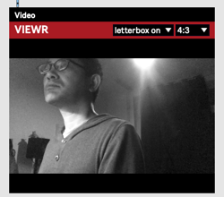
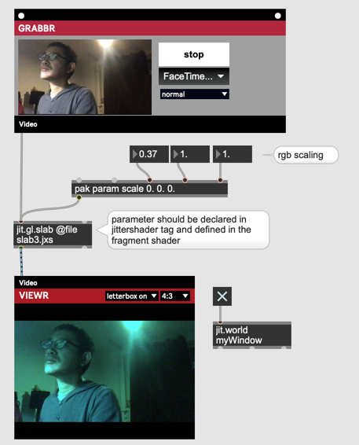

# Hardcore Video Processing (1)

Vizzie Objekte vewenden "jit.gl.slab" oder "jit.gl.pix".
Sie sind die schnittstelle zwischen Jitter und GPU.

**vz.oper8r patch**



## jit.gl.slab vs jit.gl.pix

- jit.gl.slab ... verwendet .jxs Datei. Man muss GLSL mit text schreiben.
- jit.gl.pix ... Man kann "gen" patch schreiben und jitter generierte mit dem gen Patch automatisch eine .jxs Datei

## jit.gl.slab 

## Beispiele

Es gibt viele .jxs Beispiele unter 

```
Max/Contents/Resources/C74/media/jitter/shaders
```



## Schritt 1 : Scale

```
<jittershader name="default">
	<description> Default Slab </description>
	<param name="scale" type="float" default="1.0" />
	<param name="tex0" type="int" default="0" />
	<language name="glsl" version="1.0">
		<bind param="scale" program="fp" />
		<bind param="tex0" program="fp" />		
		<program name="vp" type="vertex">
<![CDATA[
varying vec2 texcoord;
void main (void)
{
    gl_Position = ftransform();
    texcoord    = vec2(gl_TextureMatrix[0] * gl_MultiTexCoord0);
}
]]>		
		</program>
		<program name="fp" type="fragment">
<![CDATA[
varying vec2 texcoord;
uniform sampler2DRect tex0;
uniform float scale;

void main(void) 
{
	gl_FragColor = texture2DRect(tex0, texcoord) * scale;
}
]]>
		</program>
	</language>
</jittershader>
```

- zwei Programme 
    - vertex
    - fragment
    
#### Fragment Shader
```
varying vec2 texcoord;
uniform sampler2DRect tex0;
uniform float scale;

void main(void) 
{
	gl_FragColor = texture2DRect(tex0, texcoord) * scale;
}
```

- uniform ... eingegebenen Parameter mit Max Messages



## Schritt 2 : Monochrome

```
varying vec2 texcoord;
uniform sampler2DRect tex0;

void main(void) 
{
	vec4 color = texture2DRect(tex0, texcoord);
	float avg = (color.r + color.b + color.g) / 3.0;
	gl_FragColor = vec4(avg, avg, avg, 1.0);
}
```


## Schritt 3 : Color Control

jxs description
```
<jittershader name="default">
	<description> Default Slab </description>
	<param name="scale" type="vec3" default="1.0" />
	<param name="tex0" type="int" default="0" />
	<language name="glsl" version="1.0">
		<bind param="scale" program="fp" />
		<bind param="tex0" program="fp" />		
		<program name="vp" type="vertex">
```

fragment shader

```
varying vec2 texcoord;
uniform sampler2DRect tex0;
uniform vec3 scale;

void main(void) 
{
	vec4 color = texture2DRect(tex0, texcoord);
	gl_FragColor = vec4(color.r * scale.r, color.g * scale.g, color.b * scale.b, 1.0);
}
```



