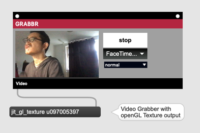
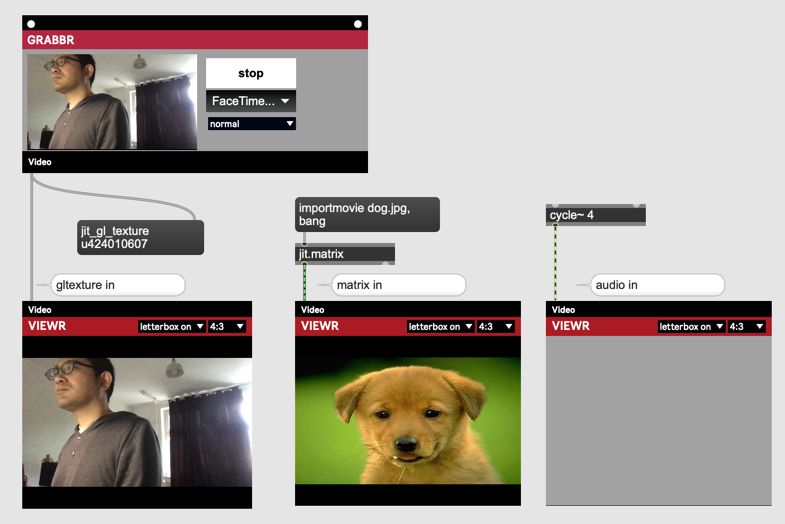
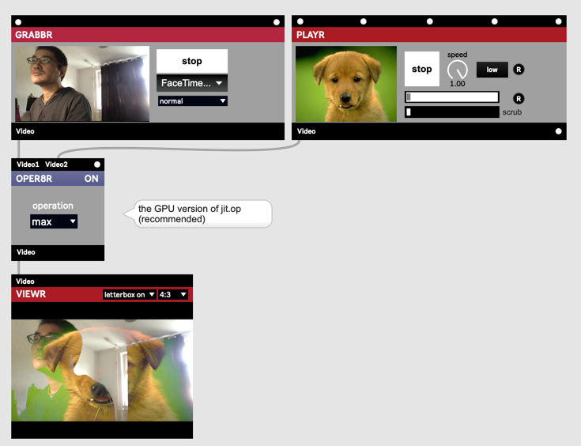
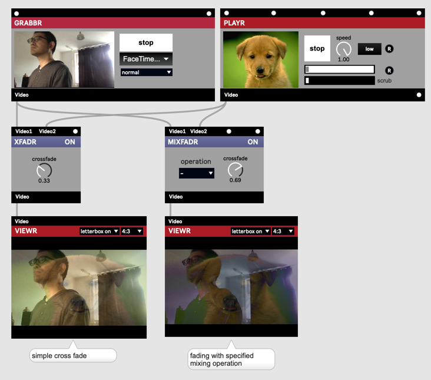
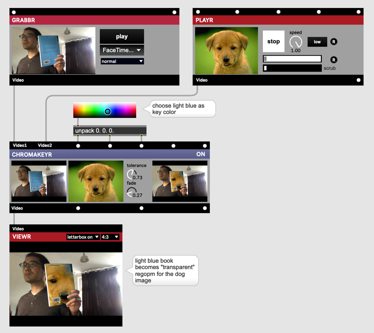
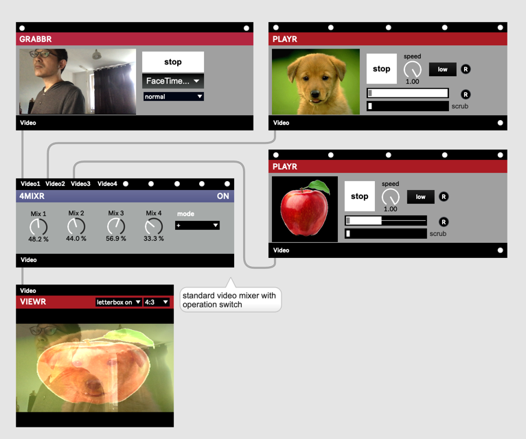
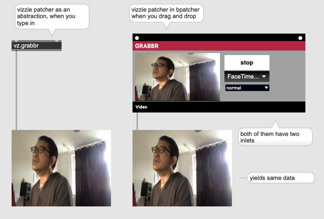

# Vizzie

#### Was ist Vizzie?
[Introducing Vizzie](https://cycling74.com/articles/introducing-vizzie)

## INPUT / OUTPUT

#### GRABBR

#### PLAYR / AVPLAYR

#### VIEWR

#### AVRECORDR / RECORDR / SNAPPER

#### PROJECTR

## EFFECT

## TRANSFORM

### Basic

### Advanced

## MIX-COMPOSITE

### OPER8R

### XFADDR/MIXFADR

### CHROMAKEYR

### 4MIXR

### Tipp
Vizzie ist eine Sammlung von Patchers.
Man kann Vizzie-Module als ein Patcher benutzen.

