# 3D mit OpenGL (3) - Generativ

#### ein anderer Ansatz mit OpenGL

- jit.gl.sketch

jit.gl.sletch interpretiert eingegebene message als OpenGL Command (wie LCD)

[OpenGL Commands](https://www.glprogramming.com/red/)

##### Dreieck mit gl.sketch
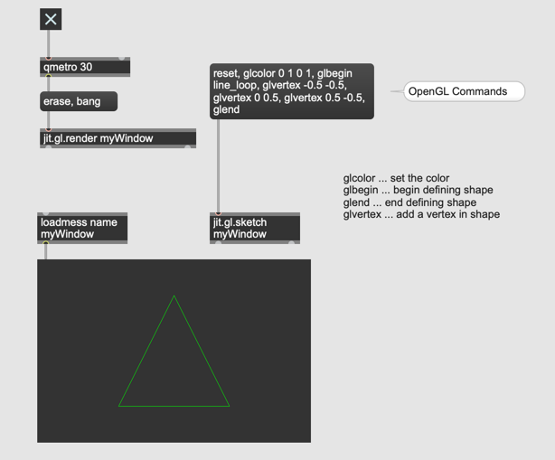

```
reset,
glcolor 0 1 0 1,
glbegin line_loop,
glvertex -0.5 -0.5,
glvertex 0 0.5,
glvertex 0.5 -0.5,
glend
```

geometric types

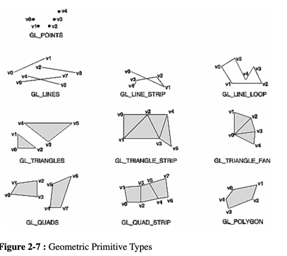

##### Random Shaping

 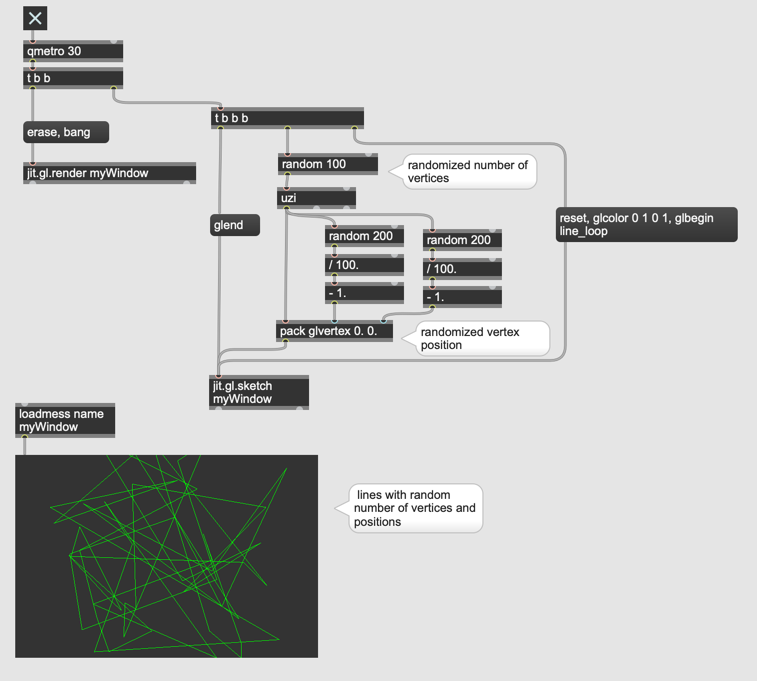

##### LCD-like message

 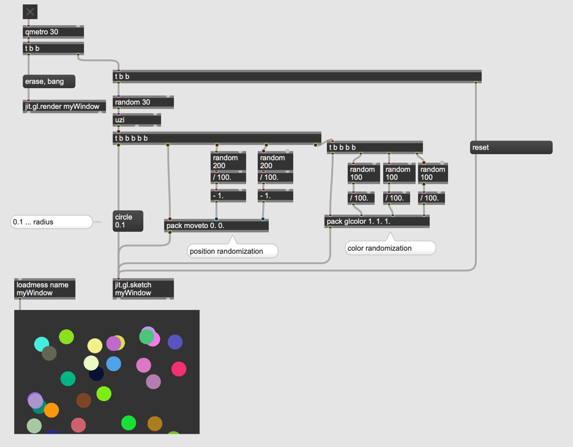

```
circle <radius>
framecircle <radius>
sphere <radius>
cylinder <scale>
torus <radius1> <radius2>
plane <scale>
cube <scale>
```

```
move <x> <y> <z>
moveto <x> <y> <z>
line <x> <y> <z>
lineto <x> <y> <z>
linesegment <x1> <y1> <z1> <x2> <y2> <z2>
tri <x1> <y1> <z1> <x2> <y2> <z2> <x3> <y3> <z3>
frametri <x1> <y1> <z1> <x2> <y2> <z2> <x3> <y3> <z3>
quad <x1> <y1> <z1> <x2> <y2> <z2> <x3> <y3> <z3> <x4> <y4> <z4>
framequad <x1> <y1> <z1> <x2> <y2> <z2> <x3> <y3> <z3> <x4> <y4> <z4>
```

##### Mit "normal" GL Objekt

 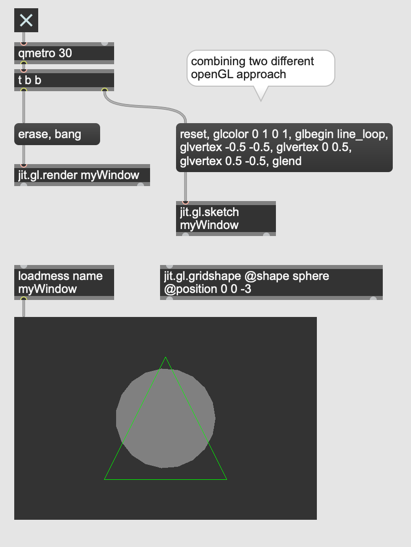
 
#### Aufgabe 1

Programieren Sie mit jit.gl.sketch ein Patch, das folgende Animation erzeugt.
   
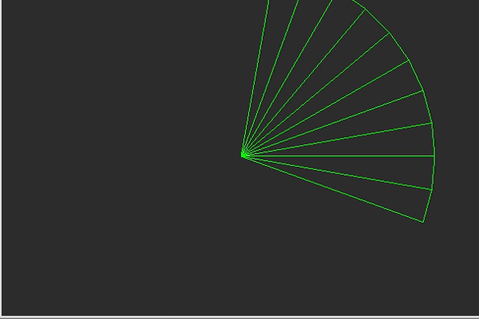


#### Instancing

- jit.gl.multiple

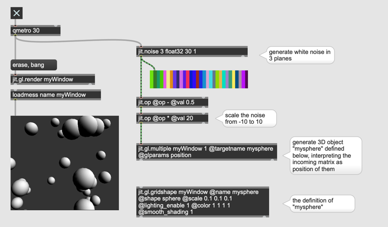


#### jit.mo Objekte

jit.mo ... generiert 1D-Matrix mit Funktionen

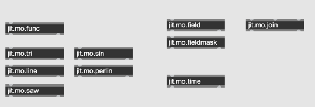

#### Sinus-Generator

- jit.mo.func

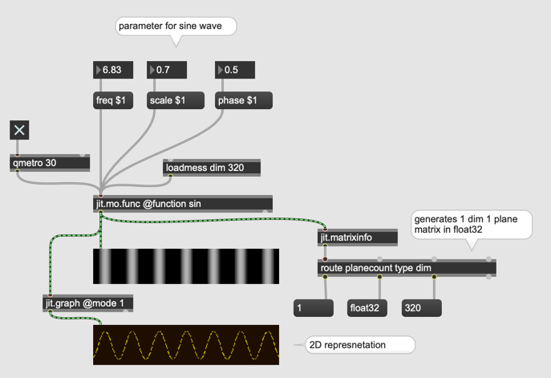


#### Perlin-Noise-Generator

- jit.mo.perlin

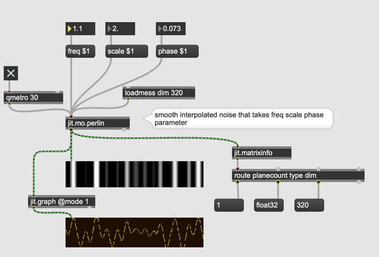


#### Line-Generator

- jit.mo.line

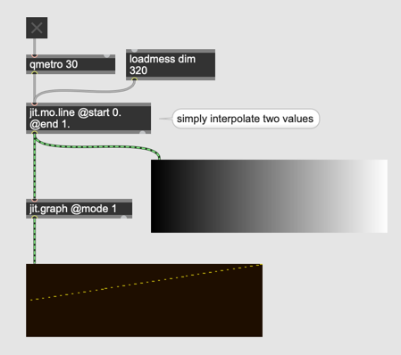


#### Kombination von mehreren Funktionen

- jit.mo.join

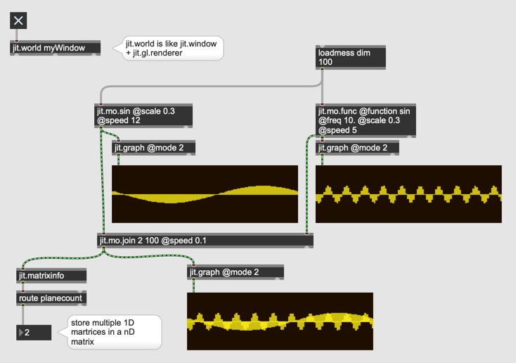


#### jit.mo und 3D instancing

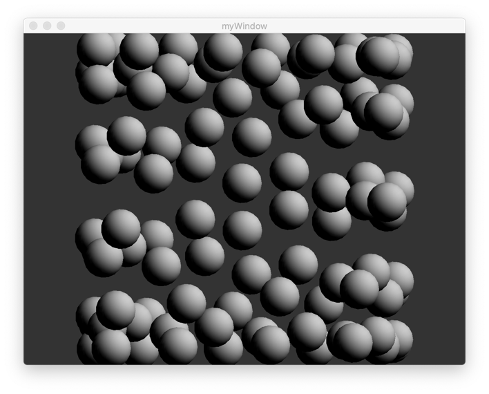

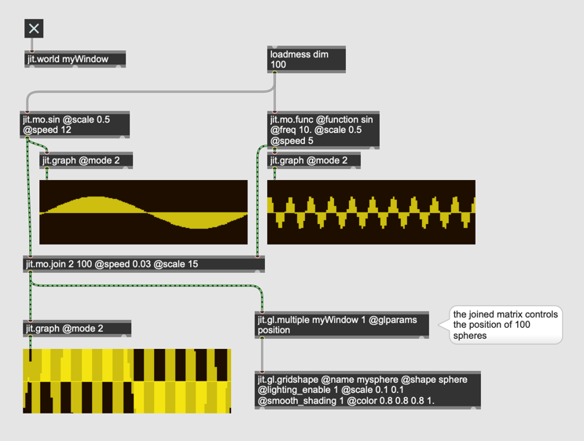


#### Schwerkraft

- jit.mo.force

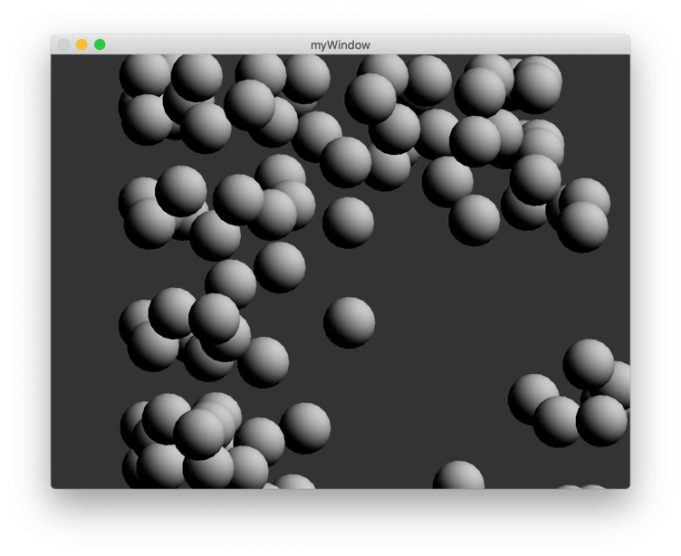


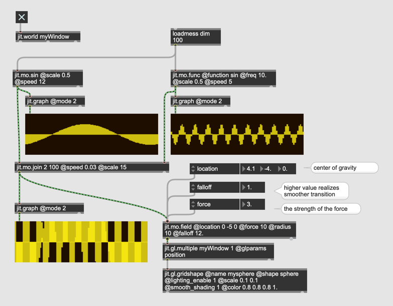

#### Abstand-basierte Verarbeitung

- jit.mo.fieldmask

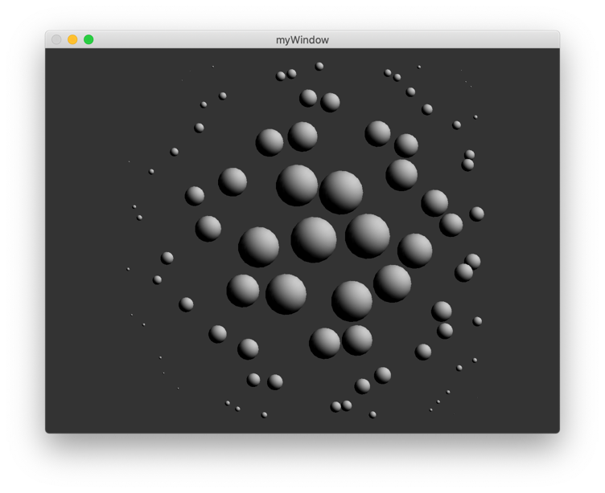


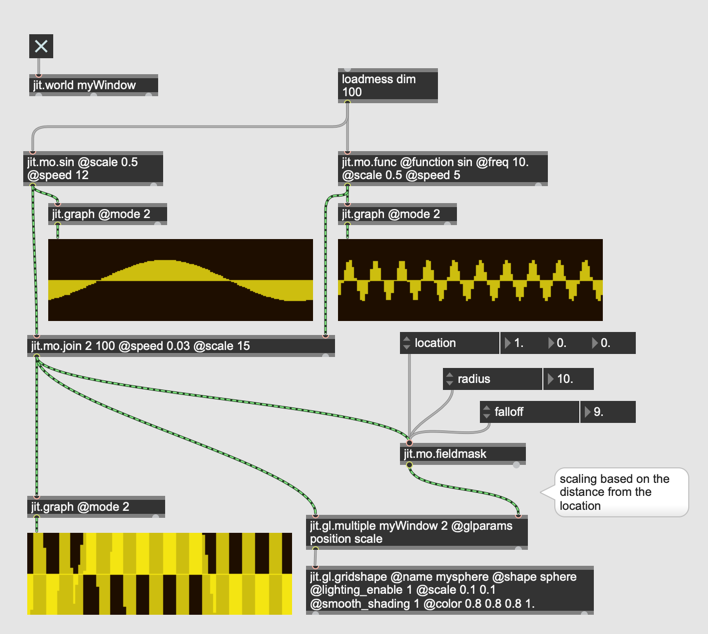

#### Path

- jit.gl.path


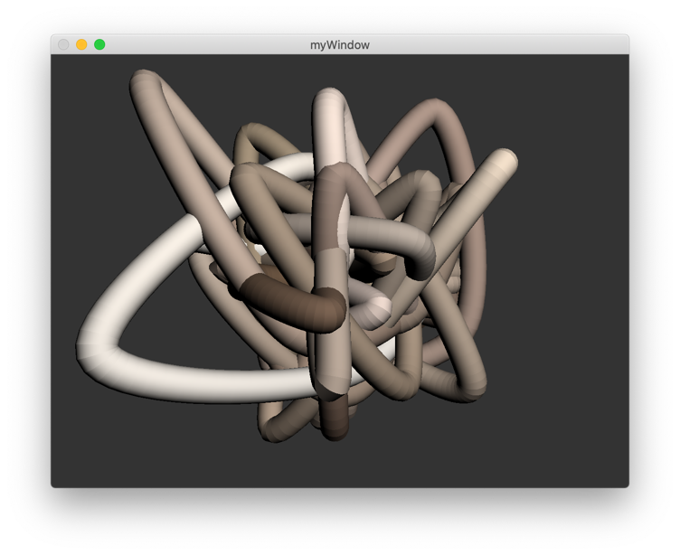


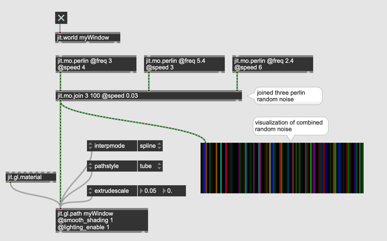

#### Aufgabe 2

Programieren Sie eine generative Animation mit jit.gl.path und jit.mo.field oder jit.mo.fieldmask
